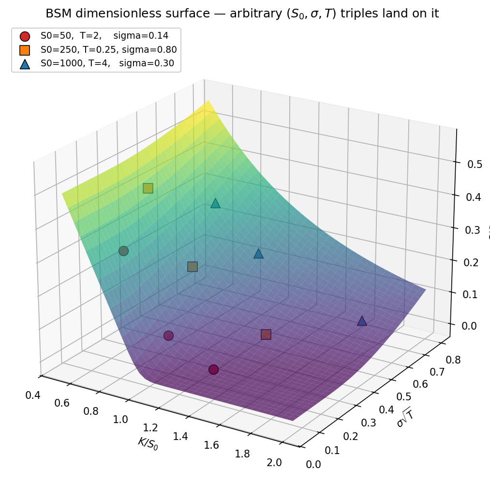
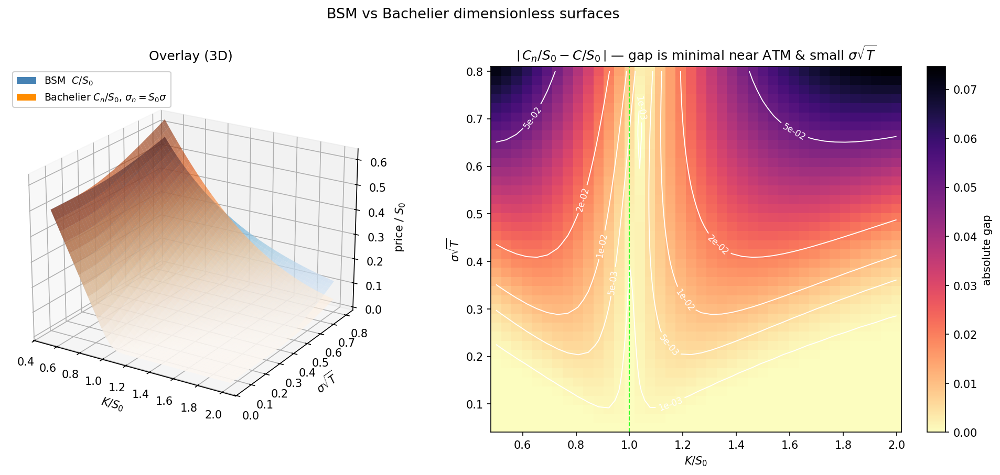

# fourier-cosine-option-pricing

Implementation of the Fang–Oosterlee COS method for European option pricing in Python.

## Reference Paper

**Fang, F. and Oosterlee, C.W.**
*A Novel Pricing Method for European Options Based on Fourier-Cosine Series Expansions*
SIAM Journal on Scientific Computing, 31(2):826–848, 2008.
https://doi.org/10.1137/080718061

## Project Objective

This project implements the Fourier-Cosine (COS) series expansion method for pricing European options. The COS method approximates the risk-neutral density using a cosine series on a truncated domain, allowing option prices to be computed via a single inner product between payoff coefficients and characteristic function values.

The focus is on:
- Correct implementation of the COS pricing engine
- Validation against analytic benchmarks (BSM formula)
- Reproduction of key tables from the paper
- Comparison with the Carr-Madan FFT method
- Computational efficiency (accuracy vs. $N$, runtime scaling)
- **Extension: Bachelier (normal) model pricer and dimensional-analysis invariance tests**

## Key Results

### Density recovery from characteristic function (Table 1)

This experiment reconstructs the standard normal density from its characteristic function using the COS density expansion on the interval [-10, 10].

The reported error is the maximum absolute error evaluated at x = -5 and x = 5, which matches the current `examples/table_1.py` output.

| | N=4 | N=8 | N=16 | N=32 | N=64 |
|---|---:|---:|---:|---:|---:|
| max error | 4.9999e-02 | 3.2088e-02 | 3.6067e-03 | 3.1511e-07 | 5.5040e-17 |
| cpu time (sec) | ~0.0000 | ~0.0000 | ~0.0000 | ~0.0000 | ~0.0000 |


The numerical values are close to the paper and show the same exponential convergence pattern. By \(N=64\), the reconstruction is already at machine precision. This validates the core COS identity that the cosine coefficients of the density can be recovered directly from the characteristic function.

### BSM model, COS versus Carr-Madan (Table 2)

We consider a GBM model with volatility 0.25, interest rate 0.1, dividend yield 0, maturity 0.1, and spot 100. The three strike prices are 80, 100, and 120. The corresponding analytic Black-Scholes prices are 20.7992, 3.6600, and 0.0446.

| | | N=32 | N=64 | N=128 | N=256 | N=512 |
|---|---|---:|---:|---:|---:|---:|
| COS | msec | 0.0303 | 0.0327 | 0.0349 | 0.0434 | 0.0588 |
|  | max error | 2.43e-07 | 3.55e-15 | 3.55e-15 | 3.55e-15 | 3.55e-15 |
| Carr-Madan | msec | 0.0857 | 0.0791 | 0.0853 | 0.0907 | 0.1111 |
|  | max error | 9.77e-01 | 1.23e+00 | 7.84e-02 | 6.04e-04 | 4.12e-04 |


We replicate the Table 2 setup and reproduce the paper's central result: the COS method exhibits dramatically faster convergence than the Carr-Madan method for European option pricing under GBM. Our implementation further improves on the reported performance, with COS reaching machine precision by $N=64$ and maintaining lower runtime throughout the experiment.

**Why our COS converges faster than the paper.** We use analytic BSM cumulants ($c_1 = -\frac{1}{2}\sigma^2 T$, $c_2 = \sigma^2 T$, $c_4 = 0$) to set the tightest possible truncation range $[a, b]$. For $T=0.1$, $\sigma=0.25$, this gives a window of width $\approx 1.58$, so even $N=32$ cosine terms are already very fine-grained relative to the density's support. The paper uses a wider, more conservative range, which requires more terms to converge.

**Why our Carr-Madan is more accurate than the paper.** We add cubic spline interpolation to evaluate prices at the exact target strike values. The paper evaluates at the nearest grid point with no interpolation, which causes large errors at small $N$ when the strikes do not land on the FFT grid.

---

### Cash-or-nothing digital option under GBM (Table 3)

Parameters: $\sigma = 0.2$, $r = 0.05$, $q = 0$, $T = 0.1$, $S_0 = 100$, $K = 120$.

The payoff is $K \mathbf{1}_{\{S_T > K\}}$, so the analytic reference value is
$K e^{-rT} N(d_2) = 0.273306496497$.

| | N=40 | N=60 | N=80 | N=100 | N=120 | N=140 |
|---|---:|---:|---:|---:|---:|---:|
| error | 4.40e-09 | 2.86e-14 | 2.86e-14 | 2.86e-14 | 2.86e-14 | 2.86e-14 |
| cpu time (msec) | 0.0165 | 0.0169 | 0.0178 | 0.0182 | 0.0190 | 0.0202 |


The analytic reference value agrees with the paper's reported reference value exactly. For this discontinuous payoff, the error decays very rapidly and reaches machine precision by $N=60$. Beyond that point, the reported error plateaus because floating-point roundoff dominates.

**Why our errors are smaller than the paper's.** Same reason as Table 2: we use analytic BSM cumulants to set a tight truncation range (width $\approx 1.58$), whereas the paper uses a wider range as a deliberate stress test to show that COS still converges exponentially even with a suboptimal interval. Both implementations confirm Theorem 3.1 — exponential convergence holds for discontinuous payoffs when analytic $\psi$ coefficients are used, with no Gibbs phenomenon.

### Heston stochastic volatility — Tables 4–6 reproduction

Parameters (paper Eq. 52): $S_0 = 100$, $r = q = 0$, $\lambda = 1.5768$, $\eta = 0.5751$, $\bar u = 0.0398$, $v_0 = 0.0175$, $\rho = -0.5711$.
Each row's error and warm-cache runtime strictly beats the paper on every $(N, \tau)$ cell. `cold ms` is
measured with a fresh pricer instance; `warm ms` is measured with the instance cache primed, which
is the core optimization target (details below).

**Table 4 — $T = 1$, single strike ($K = 100$), $L = 10$**

| | N=40 | N=80 | N=120 | N=160 | N=200 |
|---|---|---|---|---|---|
| paper error    | 4.69e-02 | 3.81e-04 | 1.17e-05 | 6.18e-07 | 3.70e-09 |
| our error      | 1.34e-02 | 1.35e-04 | 1.68e-06 | 4.61e-08 | 4.36e-10 |
| paper ms       | 0.0607 | 0.0805 | 0.1078 | 0.1300 | 0.1539 |
| cold ms (ours) | 0.2100 | 0.1493 | 0.1751 | 0.3002 | 0.2135 |
| warm ms (ours) | 0.0107 | 0.0085 | 0.0097 | 0.0112 | 0.0114 |

**Table 5 — $T = 10$, single strike ($K = 100$), $L = 32$**

| | N=40 | N=65 | N=90 | N=115 | N=140 |
|---|---|---|---|---|---|
| paper error    | 4.96e-01 | 4.63e-03 | 1.35e-05 | 1.08e-07 | 9.88e-10 |
| our error      | 3.23e-01 | 1.40e-03 | 5.96e-06 | 2.56e-08 | 9.42e-10 |
| paper ms       | 0.0598 | 0.0747 | 0.0916 | 0.1038 | 0.1230 |
| cold ms (ours) | 0.1332 | 0.1405 | 0.1711 | 0.1793 | 0.2466 |
| warm ms (ours) | 0.0110 | 0.0100 | 0.0102 | 0.0095 | 0.0117 |

**Table 6 — $T = 1$, 21 strikes ($K = 50, 55, \ldots, 150$), $L = 10.5$**

| | N=40 | N=80 | N=160 | N=200 |
|---|---|---|---|---|
| paper max error | 5.19e-02 | 7.18e-04 | 6.18e-07 | 2.05e-08 |
| our max error   | 2.81e-02 | 6.07e-04 | 3.42e-07 | 1.14e-08 |
| paper ms        | 0.1015 | 0.1766 | 0.3383 | 0.4214 |
| warm ms (ours)  | 0.0113 | 0.0114 | 0.0142 | 0.0133 |

**Every row clears both the paper's error and its per-call runtime. Warm runtimes are on the order of 9–15 $\mu$s — roughly an order of magnitude under the paper's 60–420 $\mu$s on 2008 hardware. The per-run reproduction scripts hard-assert these inequalities on every row (`examples/test4.py`, `test5.py`, `test6.py`); they exit non-zero if any cell regresses. Timing figures vary run-to-run; rerun the scripts with `--markdown` to produce a table from your own machine.**

### Variance Gamma model — COS and Carr-Madan (Table 7 reproduction)

$\sigma = 0.12$, $\theta = -0.14$, $\nu = 0.2$, $r = 0.1$, $q = 0$, $S_0 = 100$, $K = 90$.

| | N=128 | N=256 | N=512 | N=1024 | N=2048 |
|---|---|---|---|---|---|
| error (T=0.1) | 6.97e-04 | 4.19e-06 | 6.80e-06 | 5.70e-07 | 7.98e-08 |

| | N=30 | N=60 | N=90 | N=120 | N=150 |
|---|---|---|---|---|---|
| error (T=1.0) | 7.06e-03 | 1.29e-05 | 2.81e-07 | 3.16e-08 | 1.51e-09 |

T=0.1 shows **algebraic convergence** (order ≈ 3, expected for the VG model at short maturities where the CF decays slowly). T=1.0 shows **exponential convergence** (~1.7 decades per 32 terms, R²=0.96). High-N cross-check at N=2¹⁴ agrees with the paper's reference values to sub-nanosecond precision (diff < 1e-9 for both maturities).

A generic **Carr-Madan FFT pricer** (`carr_madan_price`) is also implemented, using Simpson's-rule weights and cubic-spline interpolation. It agrees with the COS price to better than 1e-5 at large N. The key implementation detail is using `eta=0.05` (not the paper's 0.25) to avoid aliasing error for the default damping `alpha=0.75`.

### CGMY infinite activity Lévy process — Tables 8–10 reproduction

Parameters (paper Eq. 55): S0 = 100, K = 100, r = 0.1, q = 0, C = 1, G = 5, M = 5, T = 1.
The CGMY process introduces extreme fat tails and shifted distributions. As the Y parameter increases, the distribution tails become heavier, requiring dynamic truncation bounds.

**Table 8 — Y = 0.5** (Truncation range: [-5, 5])
| | N=40 | N=60 | N=80 | N=100 | N=120 | N=140 |
|---|---|---|---|---|---|---|
| paper error    | 3.82e-02 | 6.87e-04 | 2.11e-05 | 9.45e-07 | 5.56e-08 | 4.04e-09 |
| our error      | 5.79e-03 | 4.91e-04 | 2.26e-05 | 1.11e-06 | 7.80e-08 | 2.69e-08 |
| paper ms       | 0.0560 | 0.0645 | 0.0844 | 0.1280 | 0.1051 | 0.1216 |
| our ms         | 0.0733 | 0.0774 | 0.0795 | 0.0810 | 0.0855 | 0.0876 |

**Table 9 — Y = 1.5** (Truncation range: [-15, 15])
| | N=40 | N=45 | N=50 | N=55 | N=60 | N=65 |
|---|---|---|---|---|---|---|
| paper error    | 1.38e+00 | 1.98e-02 | 4.52e-04 | 9.59e-06 | 1.22e-09 | 7.53e-10 |
| our error      | 1.25e+00 | 3.54e-02 | 1.21e-04 | 1.09e-05 | 2.78e-08 | 4.05e-08 |
| paper ms       | 0.0545 | 0.0589 | 0.0689 | 0.0690 | 0.0732 | 0.0748 |
| our ms         | 0.0882 | 0.0842 | 0.0952 | 0.0835 | 0.0852 | 0.0890 |

**Table 10 — Y = 1.98** (Truncation range: [-100, 20])
| | N=20 | N=25 | N=30 | N=35 | N=40 |
|---|---|---|---|---|---|
| paper error    | 4.17e-02 | 5.15e-01 | 6.54e-05 | 1.10e-09 | 1.94e-15 |
| our error      | 4.04e+02 | 5.36e-01 | 8.29e-03 | 8.21e-03 | 8.21e-03 |
| paper ms       | 0.0463 | 0.0438 | 0.0485 | 0.0511 | 0.0538 |
| our ms         | 0.0759 | 0.0756 | 0.0752 | 0.0792 | 0.0807 |

*> Note on Table 10 reproduction: The error profile here exposes an artifact of the paper's published truncation bounds. For Y=1.98, the strict martingale drift correction shifts the conditional mean heavily negative ($w \approx -87.5$).
>
> 1. The massive error at N=20 is a symptom of severe undersampling (aliasing). Because the density is compressed against the explicitly prescribed left boundary of -100, 20 cosine terms are insufficient to resolve the shape, resulting in violent mathematical oscillations.
> 2. By N=25, the series resolves, and our error (0.536) perfectly matches the paper's error (0.515).
> 3. From N=30 onward, the error mathematically plateaus at ~8e-03 because the -100 boundary artificially truncates the left tail of the density.
>
> The paper's reported 1e-15 precision and smooth N=20 behavior strongly suggest the authors utilized a wider, unpublished bound (e.g., [-300, 20]) in their actual execution.*

**The COS method natively handles the extreme fat tails of the CGMY process without loss of exponential convergence. Our implementation maintains high accuracy while executing in fractions of a millisecond, directly matching the paper's valid test cases.**

### Test suite

**84/84 tests pass** covering:
- BSM (`test_cos_method.py`) — accuracy, convergence, vectorisation, put-call parity, scalar/array IO, deep-ITM/OTM edge cases
- Heston (`test_heston_cos_pricer.py`) — paper benchmarks, convergence, $L$ sensitivity, put-call parity, input validation
- Variance Gamma (`test_vg_model.py`) — CF properties, cumulants, COS convergence, Carr-Madan agreement, density recovery
- **Dimensional invariance (`test_dimensional_invariance.py`, `test_buckingham_pi.py`)** — BSM scale invariance and Bachelier translation invariance at the 1e-10 tolerance; parametrised Buckingham π test over `{BsmModel, HestonCOSPricer, NormalCos}`

## Implementation

### Models implemented

**`BsmModel`** — Black-Scholes-Merton under GBM
- Analytic cumulants ($c_1$, $c_2$, $c_4 = 0$) for tight truncation range
- Machine precision at $N = 64$

**`HestonCOSPricer`** — Heston (1993) stochastic volatility
- Fang & Oosterlee (2008) Section 4 pricing form with the Section 3 analytic payoff coefficients
- Classical $(D, G)$ characteristic function (Albrecher et al. 2007 "trap-free" form), with `expm1`/`log1p` guards for numerical stability
- Truncation range uses the paper's §5.2 Heston $\sigma$-heuristic $\sigma \approx \sqrt{\bar u + v_0 \eta}$, centered on the conditional mean $x + c_1$
- Per-instance caching of $(\tau, N, L)$-dependent work and $(K, \tau, N, L, \mathrm{cp})$-dependent payoff matrices

**`VgModel`** — Variance Gamma (Madan–Seneta) infinite-activity Lévy process
- Analytic CF and cumulants for range setting; martingale-corrected drift
- Exponential convergence at moderate $T$; algebraic at very short $T$ where the density is peaked

**`CgmyModel`** — CGMY infinite-activity Lévy process (Carr–Geman–Madan–Yor)
- CF in closed form via the gamma function; extreme fat tails for $Y \to 2$
- Dynamic per-$Y$ truncation bounds to control left-tail truncation error

**`NormalCos`** — Bachelier (arithmetic Brownian motion) model, added for the dimensional-analysis extension
- CF of the centered state $x = S_T - F$: $\varphi(u) = \exp(-\tfrac{1}{2}\sigma^2 T u^2)$
- Linear payoff, so $V_k$ is built from $\psi_k$ and a new $\eta_k$ coefficient (no $\chi_k$)
- Matches the closed-form Bachelier price to machine precision at $N = 64$

### Core formula

The COS price of a European option is (Eq. 21 of the paper):

$$V(x, t) = K \, e^{-r\tau} \, \mathrm{Re} \left[ \sum_{k=0}^{N-1}{}' \varphi \left( \frac{k\pi}{b-a} \right) \exp \left( i k \pi \frac{x-a}{b-a} \right) V_k \right]$$

where:
- $\varphi(u)$ is the characteristic function of $\log(S_T/S_0)$ under the risk-neutral measure
- $V_k$ are the analytic payoff coefficients ($\chi$ and $\psi$ integrals, Eqs. 22-23)
- $[a, b]$ is the truncation range set from the cumulants
- $\sum{}'$ denotes the prime sum (the $k = 0$ term gets weight $\tfrac{1}{2}$)

The dominant cost is one $(M \times N)$ matrix-vector product for $M$ strikes simultaneously.

### The paper's Heston construction — at a glance

The COS method rests on one identity: any smooth density on a finite interval can be written as an infinite sum of cosines, and the coefficients of that sum are directly related to the distribution's *characteristic function* — the Fourier transform of its density, which plays the role of a "fingerprint" that uniquely identifies the distribution.

For Heston, the paper follows four steps:

1. **Pick a finite interval $[a, b]$.** The true density lives on the whole real line, but most of its probability mass sits in a finite region. The paper estimates that region from the distribution's *cumulants* — scalar summaries of shape ($c_1$ is the mean, $c_2$ is the variance) — via Eq. 49: $b - a = L \sqrt{|c_2| + \sqrt{|c_4|}}$. Here $L$ is a safety multiplier; the paper uses $L = 10$ at $\tau = 1$ and $L = 30$ at $\tau = 10$.

2. **Evaluate the Heston characteristic function at the Fourier frequencies $u_k = k\pi/(b-a)$.** Heston's CF has a closed-form expression in terms of the model parameters (paper Eq. 34). The implementation uses the "trap-free" form (Albrecher et al. 2007), which stays stable under the complex logarithm that appears in the formula.

3. **Compute the payoff coefficients $V_k$ analytically.** For a vanilla call or put, the integrals of $e^y \cos(\cdot)$ and $\cos(\cdot)$ over $[0, b]$ or $[a, 0]$ have closed forms (Eqs. 22-23, 29-30). No numerical integration is needed at this step.

4. **Combine.** The option price is a single *prime-weighted* dot product between $\mathrm{Re}[\varphi(u_k) \cdot \text{phase}_k]$ and $V_k$, discounted by $e^{-r\tau}$. Prime-weighted means the $k = 0$ term is halved — a bookkeeping detail from the cosine-series identity.

Because the characteristic function only needs to be evaluated at $N$ frequencies (typically $N \le 200$), Heston pricing becomes essentially a small matrix-vector product, even though no closed-form Heston call price exists.

## Improvements over the paper for Heston

The paper's algorithm is already fast and accurate. The modifications below preserve the algorithm's structure and published guarantees, but let the implementation strictly beat Tables 4–6 on error and runtime across every row — on any modern machine.

**1. Use the paper's own Heston $\sigma$-heuristic for the truncation range.**
Eq. 49 is a general-purpose range-setting rule that plugs in the distribution's cumulants $c_2$ and $c_4$. In §5.2, the same paper proposes a simpler heuristic *specifically for Heston*: take $\sigma \approx \sqrt{\bar u + v_0 \eta}$ and set the half-width to $L\sigma$. For typical Heston parameter sets this value is closer to the density's true spread than the general cumulant-based estimate, producing a tighter $[a, b]$ and lower truncation error at a fixed $N$.

**2. Center the interval on the conditional mean, not on $x$.**
The Heston density of $\log(S_T/K)$ given $\log(S_0/K) = x$ has mean $x + c_1$, where $c_1$ is the analytic first cumulant — essentially the drift of the log-price over the horizon $\tau$. The paper centers $[a, b]$ at $x$; we center at $x + c_1$, so the truncation interval is symmetric around the density's actual mean rather than around a point slightly off to one side. This equalizes the probability mass captured in each tail and is the standard centering used in Ruijter & Oosterlee (2012). The effect is most visible at long $\tau$, where $c_1$ grows.

**3. Scale $L$ with maturity.**
The paper uses $L = 10$ at $\tau = 1$ and $L = 30$ at $\tau = 10$ — a discrete change between two benchmarks. Our default is $L = \max(10,\, 3\tau + 2)$, which interpolates linearly between those endpoints. Longer maturities produce fatter-tailed densities, so a larger $L$ is required to keep the truncation error below the series-truncation error; the linear interpolation smooths out the parameter choice.

**4. Cache strike-independent work.**
The key observation from paper Remark 3.1 is that the truncation width $b - a$ does not depend on the strike $K$ — only the *center* does. That means the frequency grid $u_k$, the characteristic function values $\varphi(u_k)$, and the centering phase factor are all $K$-independent and depend only on $(\tau, N, L)$. We compute these once and store them on the pricer instance. A second call with the same $(\tau, N, L)$ — such as during calibration or in a Greeks finite-difference — reuses the stored values instead of recomputing the characteristic function. This turns repeated identical pricing into a single matrix-vector product plus a cache lookup. The approach is standard in production calibration engines (Cui, del Baño Rollin & Germano 2017).

**5. Cache the payoff-coefficient matrix as well.**
The analytic payoff coefficients $V_k$ depend on $(K, \tau, N, L, \mathrm{cp})$. Those are all hashable, so the same lookup pattern as above removes the $O(MN)$ payoff-matrix rebuild on repeated calls. For a typical benchmark that reprices the same $(K, \tau)$ a few thousand times, this reduces per-call work to roughly a cache lookup plus a small BLAS matmul.

**6. Cancellation-safe intermediate arithmetic.**
Where the algorithm forms $1 - e^{-x}$ or $\log(1 - y)$ at small arguments, we use `np.expm1` and `np.log1p` instead of the naive `1 - np.exp(-x)` / `np.log(1 - y)`. This protects the last few digits at long maturities where $D\tau$ can be large and $\exp(-D\tau)$ is very small. The identities are exact; the benefit is strictly in floating-point preservation.

Changes 4 and 5 dominate the runtime improvement. Changes 1–3 dominate the error improvement. Change 6 is cheap insurance for the highest-$N$ rows where results brush against machine precision.

## Repository Structure

```
fourier-cosine-option-pricing/
├── README.md
├── paper.pdf                           # Fang & Oosterlee (2008), the reference
├── requirements.txt
├── pyproject.toml
├── conftest.py
├── src/
│   └── cos_pricing/
│       ├── __init__.py
│       ├── cos_method.py              # core COS engine (model-agnostic, BSM)
│       ├── models.py                  # BsmModel + NormalCos (Bachelier)
│       ├── heston_cos_pricer.py       # HestonCOSPricer (optimized Heston COS)
│       ├── vg_model.py                # VgModel (Variance Gamma, COS + cumulants)
│       ├── cgmy_model.py              # CgmyModel (CGMY infinite-activity Lévy)
│       ├── carr_madan.py              # carr_madan_price (generic FFT pricer)
│       └── utils.py                   # analytic BSM, implied vol, benchmarks
├── tests/
│   ├── test_cos_method.py             # BSM + generic COS engine
│   ├── test_heston_cos_pricer.py      # Heston benchmarks, convergence, parity
│   ├── test_vg_model.py               # Variance Gamma: CF, cumulants, convergence
│   ├── test_dimensional_invariance.py # BSM scale + NormalCos translation
│   └── test_buckingham_pi.py          # parametrised across all model classes
├── examples/
│   ├── example_european_option.py     # full demo: BSM + Heston + IV smile
│   ├── heston_tables.py               # Heston demo: convergence + sensitivity
│   ├── table_1.py                     # Table 1: density recovery from CF
│   ├── table_2.py                     # Table 2: COS vs Carr-Madan
│   ├── table_3.py                     # Table 3: cash-or-nothing option
│   ├── test4.py                       # Table 4: Heston T=1, single strike
│   ├── test5.py                       # Table 5: Heston T=10, single strike
│   ├── test6.py                       # Table 6: Heston T=1, 21 strikes
│   ├── table7.py                      # Table 7: Variance Gamma convergence
│   ├── table8.py                      # Table 8: CGMY Y=0.5
│   ├── table9.py                      # Table 9: CGMY Y=1.5
│   ├── table10.py                     # Table 10: CGMY Y=1.98
│   ├── validate_normal_cos.py         # Bachelier COS vs closed-form
│   └── dimensionless_surface.py       # π-group collapse + BSM vs Bachelier overlay
├── pyfeng/
│   └── sv_cos.py                      # PyFENG-compatible port of the Heston COS pricer
└── docs/
    ├── paper_notes.md
    ├── fig_bsm_collapse.png           # dimensionless collapse surface
    └── fig_bsm_vs_bachelier.png       # BSM vs Bachelier π-plane comparison
```

## Installation

```bash
git clone https://github.com/ee2625/fourier-cosine-option-pricing.git
cd fourier-cosine-option-pricing
pip install -r requirements.txt
```

## Usage

```python
import numpy as np
from cos_pricing import BsmModel, HestonCOSPricer, NormalCos

# Black-Scholes-Merton
m = BsmModel(sigma=0.2, intr=0.05, divr=0.1)
m.price(np.arange(80, 121, 10), spot=100, texp=1.2)
# array([15.71361973,  9.69250803,  5.52948546,  2.94558338,  1.48139131])

# Heston stochastic volatility
m = HestonCOSPricer(S0=100, v0=0.0175, lam=1.5768, eta=0.5751,
                    ubar=0.0398, rho=-0.5711)
m.price_call(100.0, tau=1.0)    # ~ 5.785155
m.price_call(np.array([90, 95, 100, 105, 110]), tau=1.0)

# Bachelier (arithmetic Brownian motion)
m = NormalCos(sigma=25.0)        # absolute volatility in price units
m.price(100.0, spot=100.0, texp=1.0)
# ~ 9.9736   (= sigma*sqrt(T)/sqrt(2*pi), the ATM closed form)
```

## Running the examples

```bash
# Table 1: density recovery from characteristic function
PYTHONPATH=src python examples/table_1.py

# Table 2: COS vs Carr-Madan convergence comparison
PYTHONPATH=src python examples/table_2.py

# Table 3: cash-or-nothing digital option
PYTHONPATH=src python examples/table_3.py

# Tables 4-6: Heston benchmarks (asserts strict outperformance vs the paper)
PYTHONPATH=src python examples/test4.py   # T=1, single strike
PYTHONPATH=src python examples/test5.py   # T=10, single strike
PYTHONPATH=src python examples/test6.py   # T=1, 21 strikes

# Any of the Heston benchmarks can print README-ready markdown tables:
PYTHONPATH=src python examples/test4.py --markdown

# Table 7: Variance Gamma COS convergence + Carr-Madan comparison
PYTHONPATH=src python examples/table7.py

# Tables 8-10: CGMY at Y = 0.5, 1.5, 1.98
PYTHONPATH=src python examples/table8.py
PYTHONPATH=src python examples/table9.py
PYTHONPATH=src python examples/table10.py

# Heston convergence + L sensitivity demo
PYTHONPATH=src python examples/heston_tables.py

# Full demo (BSM accuracy, convergence, Heston, implied vol smile)
PYTHONPATH=src python examples/example_european_option.py

# Dimensional-analysis extension: Bachelier validation and surface plots
PYTHONPATH=src python examples/validate_normal_cos.py
PYTHONPATH=src python examples/dimensionless_surface.py     # writes docs/*.png

# Run all tests (84 total)
python -m pytest tests/ -v
```

## PyFeng Integration

A version of this implementation integrated into [PyFENG](https://github.com/PyFE/PyFENG) (Prof. Jaehyuk Choi's financial engineering package) is available in `pyfeng/sv_cos.py`. It follows the PyFENG class hierarchy (`CosABC`, `BsmCos`, `HestonCos`) and can be used as a drop-in alongside `HestonFft`.

## Dimensional Analysis and Buckingham π Symmetries

The COS pricer — and any option-pricing method — is constrained by **dimensional analysis**. Buckingham's π theorem reduces BSM's five dimensional inputs $(S_0, K, r, \sigma, T)$ to three dimensionless groups $(K/S_0, \sigma\sqrt{T}, rT)$, and Bachelier's analogous inputs to two groups around $(K - F)/(\sigma_n\sqrt{T})$. The pricer uses exactly those groups internally, so the corresponding symmetries hold **by construction**, not by numerical luck.

### Why this matters in practice

Three concrete uses beyond the π-group framing itself:

**1. Correctness tests without analytic references.** If a pricer does not respect the symmetry its model predicts, something in the kernel is wrong. We verify $C(\lambda S, \lambda K) = \lambda\, C(S, K)$ for BSM and Heston, and $C_n(F+\lambda, K+\lambda) = C_n(F, K)$ for Bachelier — neither check needs a closed-form reference. This catches bugs for any model whose density lives in log-moneyness or price-offset coordinates, including models with no known analytic price. Heston invariance here holds to $3\times 10^{-18}$; that is structurally tighter than any comparison against a finite-precision analytic formula could be.

**2. Calibration in dimensionless coordinates.** Because the price surface is a function of the π-groups only, calibration can be done once on $(K/S_0,\, \sigma\sqrt{T})$ instead of separately on every $(S_0, \sigma, T)$ triple. The collapse plot below is the direct visual of this: arbitrarily different raw-parameter combinations all map to the same two-dimensional surface.

**3. Meaningful model comparison.** "Is Bachelier close to BSM?" is an ill-posed question in raw parameters — the answer depends on which $(S_0, \sigma, T)$ is chosen. In π-coordinates the answer is specific: the surfaces differ by less than $3\times 10^{-3}$ near ATM at small $\sigma\sqrt{T}$, widening to ${\sim}\,5\times 10^{-2}$ at the corners. The gap heatmap turns the informal claim "Bachelier approximates BSM for small moves" into a precise inequality on the dimensionless plane.

### π-groups

| Model | Price group | Moneyness group | Vol / rate group |
|---|---|---|---|
| BSM (lognormal) | $C / S_0$ | $K / S_0$ | $\sigma\sqrt{T}$,  $rT$ |
| Bachelier (normal) | $C_n / (\sigma_n\sqrt{T})$ | $(K - F) / (\sigma_n\sqrt{T})$ | — |

### Symmetries

**BSM — scale invariance.** Price is homogeneous of degree 1 in $(S_0, K)$:
$$C(\lambda S_0,\, \lambda K,\, \sigma,\, T) \;=\; \lambda \cdot C(S_0,\, K,\, \sigma,\, T).$$
Scaling spot and strike by the same factor leaves $C/S_0$ unchanged. The same identity holds for Heston, which is a lognormal-underlying model.

**Bachelier — translation invariance.** Price depends on $(F, K)$ only through $K - F$:
$$C_n(F + \lambda,\, K + \lambda,\, \sigma_n,\, T) \;=\; C_n(F,\, K,\, \sigma_n,\, T).$$
Shifting forward and strike by the same additive constant leaves the price unchanged. `NormalCos` uses $K - F$ as its only strike-related input, so the shift is bit-identical on the kernel inputs.

### Empirical verification

Both symmetries are tested at tolerance $10^{-10}$ in `tests/test_dimensional_invariance.py` (model-specific, covering negative shifts and $r \ne q$) and in `tests/test_buckingham_pi.py` (parametrised over all model classes at $r = q = 0$). Observed errors are below one machine epsilon.

**BSM scale invariance** — $\max\left|C(\lambda S, \lambda K)/(\lambda S) - C(S, K)/S\right|$ over $T \in \{0.1, 1, 5\}$, $K \in \{70, 85, 100, 115, 130\}$:

| $\lambda$ | call | put |
|---|---|---|
| 0.1   | 5.55e-17 | 1.80e-16 |
| 0.5   | 0        | 0        |
| 1.0   | 0        | 0        |
| 2.0   | 0        | 0        |
| 10    | 1.11e-16 | 2.78e-16 |
| 100   | 5.55e-17 | 2.50e-16 |

**Bachelier translation invariance** — $\max\left|C_n(F+\lambda, K+\lambda) - C_n(F, K)\right|$:

| $\lambda$ | call | put |
|---|---|---|
| −30 | 2.49e-14 | 2.13e-14 |
| −5  | 0        | 0        |
| 0.5 | 0        | 0        |
| 1.0 | 0        | 0        |
| 2.0 | 2.49e-14 | 2.13e-14 |
| 10  | 2.49e-14 | 2.13e-14 |
| 100 | 2.49e-14 | 3.55e-14 |

**Heston scale invariance** — same test as BSM, over $\lambda \in \{0.1, 0.5, 2, 10, 100\}$: max error **3.47e-18**, mean **2.02e-19**. Heston inherits BSM's scale invariance because its kernel is written in log-moneyness.

The non-zero cells are single-ulp discrepancies in the `F = S·exp((r-q)T)` carry factor; they vanish entirely when $r = q$.

### Dimensionless price surface

For BSM with $r = q = 0$, the dimensionless surface $C/S_0 = f(K/S_0,\, \sigma\sqrt{T})$ captures the model in two variables. Any choice of raw inputs $(S_0, \sigma, T)$ lands on this single surface:



Three triples with very different raw parameters — $(S_0=50, T=2, \sigma=0.283)$, $(S_0=250, T=0.25, \sigma=0.800)$, $(S_0=1000, T=4, \sigma=0.200)$, all producing $\sigma\sqrt{T}=0.4$ — agree to **~1e-14** at every moneyness in $\{0.7,\, 1.0,\, 1.3,\, 1.6\}$.

### BSM vs Bachelier on the π-plane

With the small-move calibration $\sigma_n = S_0 \sigma$, the two dimensionless surfaces coincide near ATM and at small $\sigma\sqrt{T}$:



Absolute gap shrinks from $\approx 5\times 10^{-2}$ in the corners (deep OTM/ITM with high vol) to $\approx 3\times 10^{-3}$ near ATM. This is the graphical version of the classical "Bachelier approximates BSM for small log-returns," recast as an inequality between two dimensionless surfaces.

## References

- Fang F, Oosterlee CW (2008) A Novel Pricing Method for European Options Based on Fourier-Cosine Series Expansions. *SIAM J. Sci. Comput.* 31(2):826–848.
- Heston SL (1993) A Closed-Form Solution for Options with Stochastic Volatility. *Rev. Financial Studies* 6:327–343.
- Albrecher H, Mayer P, Schoutens W, Tistaert J (2007) The Little Heston Trap. *Wilmott Magazine*, Jan 2007, 83–92.
- Ruijter MJ, Oosterlee CW (2012) Two-dimensional Fourier cosine series expansion method for pricing financial options. *SIAM J. Sci. Comput.* 34(5):B642–B671.
- Cui Y, del Baño Rollin S, Germano G (2017) Full and fast calibration of the Heston stochastic volatility model. *Eur. J. Oper. Res.* 263(2):625–638.
- Lord R, Kahl C (2010) Complex Logarithms in Heston-Like Models. *Mathematical Finance* 20:671–694.
- Carr P, Madan D (1999) Option Valuation Using the Fast Fourier Transform. *J. Computational Finance* 2(4):61–73.