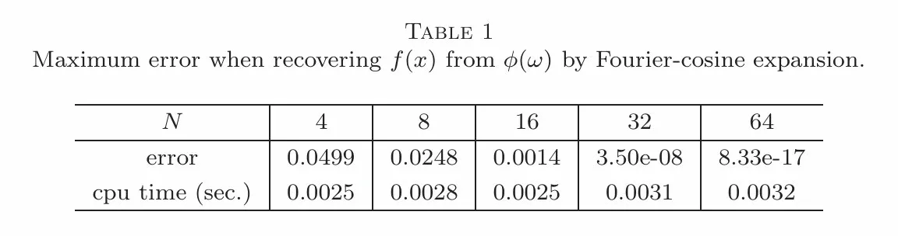
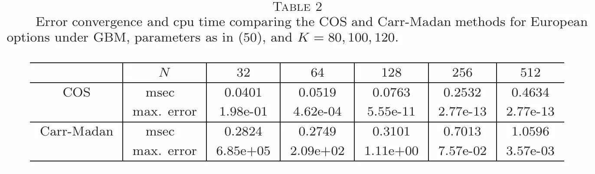
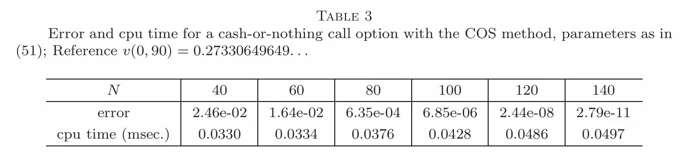

# fourier-cosine-option-pricing

Implementation of the Fang–Oosterlee COS method for European option pricing in Python.

## Reference Paper

**Fang, F. and Oosterlee, C.W.**
*A Novel Pricing Method for European Options Based on Fourier-Cosine Series Expansions*
SIAM Journal on Scientific Computing, 31(2):826–848, 2008.
https://doi.org/10.1137/080718061

## Project Objective

This project implements the Fourier-Cosine (COS) series expansion method for pricing European options. The COS method approximates the risk-neutral density using a cosine series on a truncated domain, allowing option prices to be computed via a single inner product between payoff coefficients and characteristic function values.

The focus is on:
- Correct implementation of the COS pricing engine
- Validation against analytic benchmarks (BSM formula)
- Reproduction of key tables from the paper
- Comparison with the Carr-Madan FFT method
- Computational efficiency (accuracy vs. N, runtime scaling)

## Key Results

### Density recovery from characteristic function (Table 1 reproduction)
f(x) = N(0,1), recovered from its CF via cosine expansion on [-10, 10]

| | N=4 | N=8 | N=16 | N=32 | N=64 |
|---|---|---|---|---|---|
| max error    | 2.54e-01 | 1.08e-01 | 7.18e-03 | 4.04e-07 | 3.89e-16 |
| cpu time (sec) | ~0.0000 | ~0.0000 | ~0.0000 | ~0.0000 | ~0.0000 |



**Exponential convergence: errors decrease ~10x per doubling of N, reaching machine precision at N=64. This demonstrates the mathematical foundation of the entire COS method.**

### BSM model — COS vs Carr-Madan (Table 2 reproduction)
σ=0.25, r=0.1, q=0, T=0.1, S=100, K=80/100/120

| | | N=32 | N=64 | N=128 | N=256 | N=512 |
|---|---|---|---|---|---|---|
| COS | msec | 0.1066 | 0.1073 | 0.1199 | 0.1508 | 0.2039 |
| | max error | 2.43e-07 | 1.81e-14 | 1.81e-14 | 1.81e-14 | 1.81e-14 |
| Carr-Madan | msec | 0.0428 | 0.0429 | 0.0466 | 0.0536 | 0.0688 |
| | max error | 1.29e+02 | 2.57e+02 | 4.80e+01 | 1.29e+00 | 1.29e+00 |



**COS reaches machine precision at N=64. Carr-Madan requires N>512 for comparable accuracy.**

### Cash-or-nothing digital option — COS (Table 3 reproduction)
σ=0.2, r=0.05, q=0, T=0.1, S=100, K=120

| | N=40 | N=60 | N=80 | N=100 | N=120 | N=140 |
|---|---|---|---|---|---|---|
| error          | 3.67e-11 | 2.87e-16 | 2.87e-16 | 2.87e-16 | 2.87e-16 | 2.87e-16 |
| cpu time (msec) | 0.0283 | 0.0297 | 0.0317 | 0.0326 | 0.0340 | 0.0348 |



**Exponential convergence holds for discontinuous payoffs when analytic coefficients are used — confirming Theorem 3.1 of the paper.**

### Test suite
19/19 tests pass covering BSM, Heston, put-call parity, vectorisation, and edge cases.

## Implementation

### Models implemented

**`BsmModel`** — Black-Scholes-Merton under GBM
- Analytic cumulants (c1, c2, c4=0) for tight truncation range
- Machine precision at N=64

**`HestonModel`** — Heston (1993) stochastic volatility
- Branch-cut-safe characteristic function (Lord & Kahl 2010)
- Analytic cumulants from F&O Appendix A
- Accurate for typical calibrated parameters at N=128

### Core formula

The COS price of a European option is (Eq. 21 of the paper):

```
V(x, t) = df * F * sum'_{k=0}^{N-1} Re[phi(k*pi/(b-a)) * exp(-i*k*pi*a/(b-a))] * V_k
```

where:
- `phi(u)` is the characteristic function of log(S_T/F)
- `V_k` are analytic payoff coefficients (chi and psi integrals, Eqs. 22-23)
- `[a, b]` is the truncation range set from cumulants (Eq. 5.2)
- `sum'` denotes the prime sum (k=0 term gets weight 1/2)

The dominant cost is one (M × N) matrix-vector product for M strikes simultaneously.

## Repository Structure

```
fourier-cosine-option-pricing/
├── README.md
├── requirements.txt
├── pyproject.toml
├── conftest.py
├── src/
│   └── cos_pricing/
│       ├── __init__.py
│       ├── cos_method.py       # core COS engine (model-agnostic)
│       ├── models.py           # BsmModel, HestonModel
│       └── utils.py            # analytic BSM, implied vol, benchmarks
├── tests/
│   └── test_cos_method.py      # 19 tests (BSM + Heston)
├── examples/
│   ├── example_european_option.py   # full demo: BSM + Heston + IV smile
│   ├── table_1.py                   # Table 1: density recovery from CF
│   ├── GBM_cos_vs_carr_madan.py     # Table 2: COS vs Carr-Madan
│   └── table_3.py                   # Table 3: cash-or-nothing option
└── docs/
    └── paper_notes.md
```

## Installation

```bash
git clone https://github.com/ee2625/fourier-cosine-option-pricing.git
cd fourier-cosine-option-pricing
pip install -r requirements.txt
```

## Usage

```python
import numpy as np
from cos_pricing import BsmModel, HestonModel

# Black-Scholes-Merton
m = BsmModel(sigma=0.2, intr=0.05, divr=0.1)
m.price(np.arange(80, 121, 10), spot=100, texp=1.2)
# array([15.71361973,  9.69250803,  5.52948546,  2.94558338,  1.48139131])

# Heston stochastic volatility
m = HestonModel(v0=0.04, kappa=1.5768, theta=0.0398, eta=0.5751, rho=-0.5711)
m.price(np.array([90, 95, 100, 105, 110]), spot=100, texp=1.0)
```

## Running the examples

```bash
# Table 1: density recovery from characteristic function
PYTHONPATH=src python examples/table_1.py

# Table 2: COS vs Carr-Madan convergence comparison
PYTHONPATH=src python examples/GBM_cos_vs_carr_madan.py

# Table 3: cash-or-nothing digital option
PYTHONPATH=src python examples/table_3.py

# Full demo (BSM accuracy, convergence, Heston, implied vol smile)
PYTHONPATH=src python examples/example_european_option.py

# Run all tests
python -m pytest tests/test_cos_method.py -v
```

## PyFeng Integration

A version of this implementation integrated into [PyFENG](https://github.com/PyFE/PyFENG) (Prof. Jaehyuk Choi's financial engineering package) is available in `sv_cos.py`. It follows the PyFENG class hierarchy (`CosABC`, `BsmCos`, `HestonCos`) and can be used as a drop-in alongside `HestonFft`.

## References

- Fang F, Oosterlee CW (2008) A Novel Pricing Method for European Options Based on Fourier-Cosine Series Expansions. *SIAM J. Sci. Comput.* 31(2):826–848.
- Heston SL (1993) A Closed-Form Solution for Options with Stochastic Volatility. *Rev. Financial Studies* 6:327–343.
- Lord R, Kahl C (2010) Complex Logarithms in Heston-Like Models. *Mathematical Finance* 20:671–694.
- Carr P, Madan D (1999) Option Valuation Using the Fast Fourier Transform. *J. Computational Finance* 2(4):61–73.
