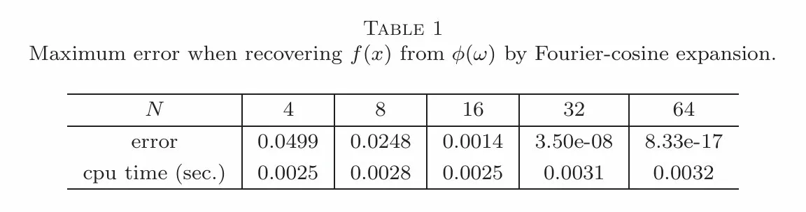
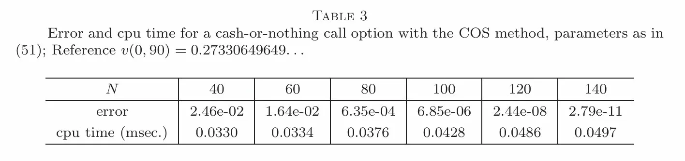
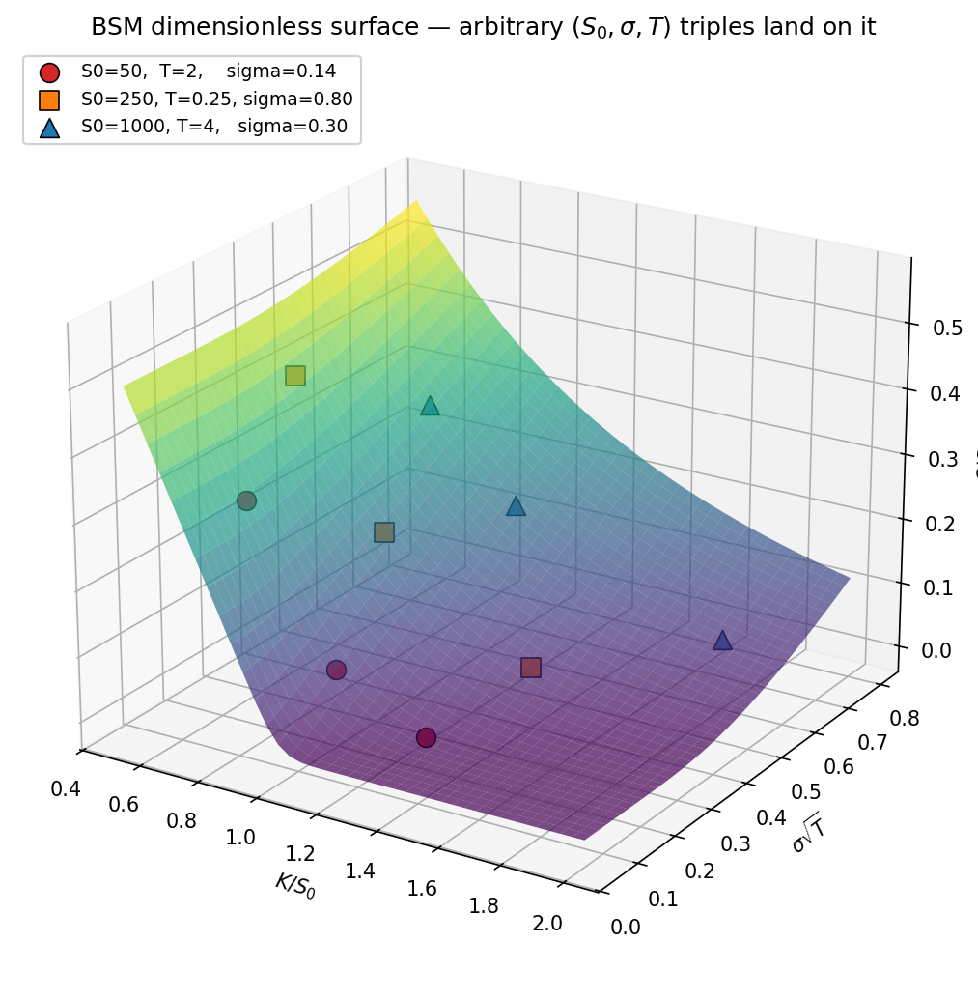
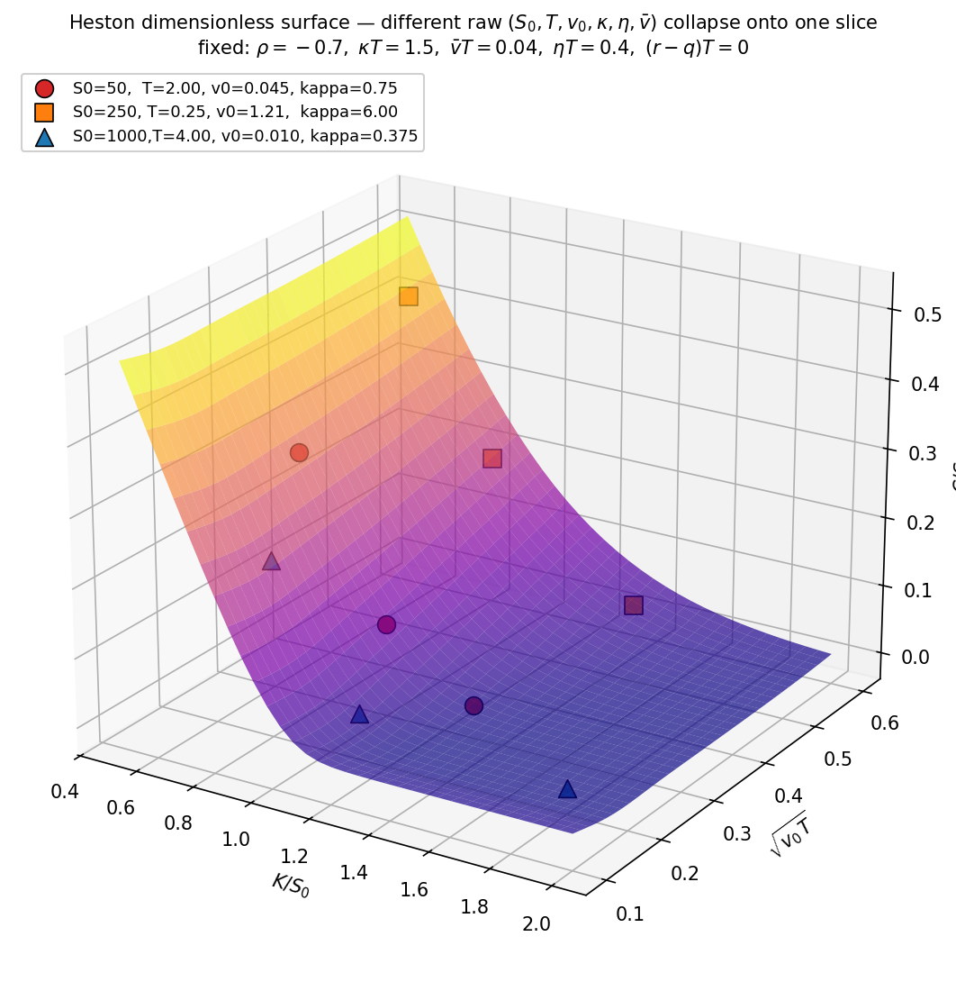

# fourier-cosine-option-pricing

Implementation of the Fang–Oosterlee COS method for European option pricing in Python, with extensions for early exercise and dimensional-analysis symmetry checks.

**Reference paper.** Fang, F. and Oosterlee, C.W. *A Novel Pricing Method for European Options Based on Fourier-Cosine Series Expansions.* SIAM J. Sci. Comput. 31(2):826–848, 2008. <https://doi.org/10.1137/080718061>

**What this repo covers.** Reproduction and diagnostics for the Fang-Oosterlee benchmark tables (BSM, Heston, Variance Gamma, CGMY), with the CGMY $Y=1.98$ case called out as an unresolved caveat; a four-way comparison of the COS method against three other CF-based pricers (Lewis 2001, Carr-Madan, fractional FFT); the early-exercise extension from the Fang-Oosterlee 2009 follow-up paper; and structural π-symmetry verification across all four models.

## Quick start

```bash
git clone https://github.com/ee2625/fourier-cosine-option-pricing.git
cd fourier-cosine-option-pricing
pip install -r requirements.txt
```

```python
import numpy as np
from cos_pricing import BsmModel, HestonCOSPricer, VgModel, CgmyModel, BermudanCosBSM

m = BsmModel(sigma=0.2, intr=0.05, divr=0.1)
m.price(np.arange(80, 121, 10), spot=100, texp=1.2)
# array([15.71361973,  9.69250803,  5.52948546,  2.94558338,  1.48139131])

m = HestonCOSPricer(S0=100, v0=0.0175, lam=1.5768, eta=0.5751,
                    ubar=0.0398, rho=-0.5711)
m.price_call(100.0, tau=1.0)                                    # ~ 5.785155

ber = BermudanCosBSM(sigma=0.25, intr=0.1)
ber.price_put(S=100.0, K=100.0, T=1.0, M=10, N=128)             # Bermudan put
ber.price_call(S=100.0, K=100.0, T=1.0, M=10, N=128)            # Bermudan call (q > 0 for early exercise to matter)
```

---

## Results

### Table 1 — Density recovery from the characteristic function

Reconstruct the standard normal density from its CF using the COS density expansion on $[-10, 10]$. Reported error is the maximum absolute error at $x = -5$ and $x = 5$.

| | N=4 | N=8 | N=16 | N=32 | N=64 |
|---|---:|---:|---:|---:|---:|
| max error | 4.9999e-02 | 3.2088e-02 | 3.6067e-03 | 3.1511e-07 | 5.5040e-17 |
| cpu time (sec) | ~0.0000 | ~0.0000 | ~0.0000 | ~0.0000 | ~0.0000 |



By $N=64$ the reconstruction is at machine precision — the core COS identity that the cosine coefficients of the density can be read straight off the CF.

---

### Table 2 — BSM, four CF-based pricers on one bench: COS vs Lewis vs FrFT vs Carr-Madan

GBM with $\sigma = 0.25$, $r = 0.1$, $q = 0$, $T = 0.1$, spot 100, strikes $\{80, 100, 120\}$. Analytic Black-Scholes references: 20.7992, 3.6600, 0.0446. Carr-Madan uses the paper's stated Fourier truncation range $[0,100]$, i.e. $\eta=100/N$.

| | | N=32 | N=64 | N=128 | N=256 | N=512 |
|---|---|---:|---:|---:|---:|---:|
| COS | msec | 0.0642 | 0.0632 | 0.0724 | 0.0941 | 0.1259 |
|  | max error | 2.05e-05 | <2e-14 | <2e-14 | <2e-14 | <2e-14 |
| Lewis | msec | 0.0730 | 0.1318 | 0.3929 | 1.4220 | 5.5751 |
|  | max error | 4.16e+00 | 1.52e-02 | 3.53e-06 | 3.90e-10 | 2.08e-10 |
| FrFT | msec | 0.1125 | 0.1122 | 0.1286 | 0.1346 | 0.1709 |
|  | max error | 1.17e+01 | 1.94e+00 | 1.37e+00 | 7.94e-02 | 1.92e-04 |
| Carr-Madan | msec | 0.0890 | 0.0909 | 0.0978 | 0.1037 | 0.1207 |
|  | max error | 1.17e+01 | 1.89e+00 | 1.37e+00 | 8.06e-02 | 1.35e-03 |

The current plot for this comparison is generated in [`notebooks/tests.ipynb`](notebooks/tests.ipynb); the table above is the source-of-truth summary.

Four distinct convergence regimes on one benchmark:

- **COS** — finite-domain Fourier-cosine series with analytic payoff integrals → **exponential** convergence, machine precision at $N = 64$, lowest per-call cost.
- **Lewis (2001)** — single-integral inversion at the fixed contour shift $u - i/2$ (= Carr-Madan with the optimal symmetric damping $\alpha = 1/2$). No damping to tune; **geometric** convergence on the Gauss-Legendre nodes — each doubling of $N$ buys 3–6 orders of magnitude.
- **FrFT** — Carr-Madan integrand with the Bailey-Swarztrauber fractional FFT, which decouples the frequency grid spacing $\eta$ from the strike spacing $\lambda$. **Algebraic** convergence with a strictly tighter constant than plain Carr-Madan (~7× at $N = 512$).
- **Carr-Madan** — plain FFT with $\eta\lambda = 2\pi/N$ tied together. **Algebraic**, slowest of the four; spline interpolation papers over the coarse strike grid but cannot remove its error.

#### Why COS converges faster than the other three

All four invert the characteristic function — the difference is what gets discretized and where the regularization comes from.

- **Carr-Madan** numerically integrates the Fourier-inversion integral. The call payoff is not Fourier-integrable, so the integrand has to be *regularized with a damping parameter* $\alpha > 0$: the CF gets evaluated at $v - i(\alpha + 1)$ and the price is recovered by multiplying back by $e^{-\alpha k}$ ([carr_madan.py:37](src/cos_pricing/carr_madan.py#L37)). Picking $\alpha$ is a tuning tradeoff with no closed-form optimum.
- **FrFT** keeps the same integrand and damping but swaps the FFT for the Bailey-Swarztrauber FrFT, which lets $\eta$ and $\lambda$ be chosen independently. The damping tradeoff is unchanged so convergence stays algebraic — but the strike grid stays fine.
- **Lewis** removes the damping tradeoff entirely by fixing the contour at $\alpha = 1/2$. Single-integral, no parameter to tune, geometric convergence on Gauss-Legendre nodes.
- **COS** doesn't discretize an integral. It expands the density on a finite truncated interval $[a, b]$ as a cosine series, reads the coefficients straight off the CF at $u_k = k\pi/(b - a)$, and dot-products them against **analytic** payoff coefficients ($\chi$ and $\psi$ from Eqs. 22-23). **No damping is needed** — the CF is sampled only at real frequencies ([cos_method.py:81-84](src/cos_pricing/cos_method.py#L81-L84)).

The truncation interval $[a, b]$ in COS plays the regularizing role that damping plays in the others — but it is set deterministically from the density's cumulants (Eq. 49), not tuned by hand.

---

### Table 3 — Cash-or-nothing digital option under GBM

Parameters: $\sigma = 0.2$, $r = 0.05$, $q = 0$, $T = 0.1$, $S_0 = 100$, $K = 120$. Payoff $K \mathbf{1}_{\{S_T > K\}}$, analytic reference $K e^{-rT} N(d_2) = 0.273306496497$.

| | N=40 | N=60 | N=80 | N=100 | N=120 | N=140 |
|---|---:|---:|---:|---:|---:|---:|
| error | 4.40e-09 | 2.86e-14 | 2.86e-14 | 2.86e-14 | 2.86e-14 | 2.86e-14 |
| cpu time (msec) | 0.0165 | 0.0169 | 0.0178 | 0.0182 | 0.0190 | 0.0202 |



The error reaches machine precision by $N = 60$ even for this discontinuous payoff — confirming Theorem 3.1: exponential convergence holds for discontinuous payoffs when analytic $\psi$ coefficients are used (no Gibbs phenomenon).

---

### Tables 4–6 — Heston stochastic volatility

Parameters (paper Eq. 52): $S_0 = 100$, $r = q = 0$, $\lambda = 1.5768$, $\eta = 0.5751$, $\bar u = 0.0398$, $v_0 = 0.0175$, $\rho = -0.5711$.

The README tables below show the COS reproduction rows. The presentation notebook also includes Lewis/Carr-Madan diagnostics on method-specific Fourier grids; Carr-Madan uses the paper's Fourier truncations $[0,1200]$ for $T=1$ and $[0,500]$ for $T=10$.

**Table 4 — $T = 1$, single strike ($K = 100$), $L = 10$**

| | N=40 | N=80 | N=120 | N=160 | N=200 |
|---|---|---|---|---|---|
| paper error    | 4.69e-02 | 3.81e-04 | 1.17e-05 | 6.18e-07 | 3.70e-09 |
| our error      | 1.34e-02 | 1.35e-04 | 1.68e-06 | 4.61e-08 | 4.36e-10 |
| paper ms       | 0.0607 | 0.0805 | 0.1078 | 0.1300 | 0.1539 |
| our ms         | 0.0142 | 0.0226 | 0.0206 | 0.0242 | 0.0320 |

**Table 5 — $T = 10$, single strike ($K = 100$), $L = 32$**

| | N=40 | N=65 | N=90 | N=115 | N=140 |
|---|---|---|---|---|---|
| paper error    | 4.96e-01 | 4.63e-03 | 1.35e-05 | 1.08e-07 | 9.88e-10 |
| our error      | 3.23e-01 | 1.40e-03 | 5.96e-06 | 2.56e-08 | 9.27e-10 |
| paper ms       | 0.0598 | 0.0747 | 0.0916 | 0.1038 | 0.1230 |
| our ms         | 0.0126 | 0.0152 | 0.0182 | 0.0240 | 0.0238 |

**Table 6 — $T = 1$, 21 strikes ($K = 50, 55, \ldots, 150$), $L = 10$**

| | N=40 | N=80 | N=160 | N=200 |
|---|---|---|---|---|
| paper max error | 5.19e-02 | 7.18e-04 | 6.18e-07 | 2.05e-08 |
| our max error   | 1.92e-02 | 3.21e-04 | 1.91e-07 | 4.67e-09 |
| paper ms        | 0.1015 | 0.1766 | 0.3383 | 0.4214 |
| our ms          | 0.0198 | 0.0293 | 0.0500 | 0.0586 |

The COS rows clear the paper's reported errors in these reproduced Heston setups. Runtime comparisons are machine-dependent, so the notebook should be treated as the current executable source for timings.

---

### Table 7 — Variance Gamma

$\sigma = 0.12$, $\theta = -0.14$, $\nu = 0.2$, $r = 0.1$, $q = 0$, $S_0 = 100$, $K = 90$.

| | N=128 | N=256 | N=512 | N=1024 | N=2048 |
|---|---|---|---|---|---|
| error (T=0.1) | 6.97e-04 | 4.19e-06 | 6.80e-06 | 5.70e-07 | 7.98e-08 |

| | N=30 | N=60 | N=90 | N=120 | N=150 |
|---|---|---|---|---|---|
| error (T=1.0) | 7.06e-03 | 1.29e-05 | 2.81e-07 | 3.16e-08 | 1.51e-09 |

$T = 0.1$: **algebraic convergence** (order ≈ 3, expected for VG at short maturities where the CF decays slowly). $T = 1.0$: **exponential convergence** (~1.7 decades per 32 terms, R²=0.96). High-N cross-check at $N = 2^{14}$ agrees with the paper's reference values to sub-nanosecond precision.

---

### Tables 8–10 — CGMY infinite-activity Lévy

Parameters (paper Eq. 55): $S_0 = 100$, $K = 100$, $r = 0.1$, $q = 0$, $C = 1$, $G = 5$, $M = 5$, $T = 1$. Heavier tails as $Y$ grows; truncation widens accordingly.

**Table 8 — $Y = 0.5$** (Truncation range: $[-5, 5]$)
| | N=40 | N=60 | N=80 | N=100 | N=120 | N=140 |
|---|---|---|---|---|---|---|
| paper error    | 3.82e-02 | 6.87e-04 | 2.11e-05 | 9.45e-07 | 5.56e-08 | 4.04e-09 |
| our error      | 5.79e-03 | 4.91e-04 | 2.26e-05 | 1.11e-06 | 7.80e-08 | 2.69e-08 |
| paper ms       | 0.0560 | 0.0645 | 0.0844 | 0.1280 | 0.1051 | 0.1216 |
| our ms         | 0.0623 | 0.0619 | 0.0670 | 0.0706 | 0.0718 | 0.0769 |

**Table 9 — $Y = 1.5$** (Truncation range: $[-15, 15]$)
| | N=40 | N=45 | N=50 | N=55 | N=60 | N=65 |
|---|---|---|---|---|---|---|
| paper error    | 1.38e+00 | 1.98e-02 | 4.52e-04 | 9.59e-06 | 1.22e-09 | 7.53e-10 |
| our error      | 1.25e+00 | 3.54e-02 | 1.22e-04 | 1.07e-05 | 2.38e-07 | 1.68e-07 |
| paper ms       | 0.0545 | 0.0589 | 0.0689 | 0.0690 | 0.0732 | 0.0748 |
| our ms         | 0.0672 | 0.0666 | 0.0700 | 0.0688 | 0.0677 | 0.0687 |

**Table 10 — $Y = 1.98$** (Truncation range: $[-100, 20]$)
| | N=20 | N=25 | N=30 | N=35 | N=40 |
|---|---|---|---|---|---|
| paper error    | 4.17e-02 | 5.15e-01 | 6.54e-05 | 1.10e-09 | 1.94e-15 |
| our error      | 4.04e+02 | 5.37e-01 | 8.07e-03 | 7.99e-03 | 7.99e-03 |
| paper ms       | 0.0463 | 0.0438 | 0.0485 | 0.0511 | 0.0538 |
| our ms         | 0.0676 | 0.0675 | 0.0683 | 0.0644 | 0.0663 |

> **Note on Table 10.** We do **not** treat $Y = 1.98$ as a successful reproduction. For this near-stable CGMY case, our strict martingale implementation with the paper's stated $[-100,20]$ range converges to about `0.2601`, while the paper prints `0.252104475`. The large $N=20$ error is therefore shown as a caveat, not hidden. It likely reflects an implementation convention, branch/drift convention, or unstated numerical choice in the original paper; Carr-Madan is omitted in the presentation notebook for this case because the damped FFT overflows.

---

### Bermudan options via COS — backward induction (Fang & Oosterlee 2009)

The 2008 paper handles European options. The 2009 follow-up — *Pricing Early-Exercise and Discrete Barrier Options by Fourier-Cosine Series Expansions*, **Numerische Mathematik 114:27-62** — extends COS to early-exercise via dynamic programming on the cosine coefficients. We implement this for the BSM case in [src/cos_pricing/bermudan.py](src/cos_pricing/bermudan.py) for both **puts and calls**.

**Algorithm.** For a Bermudan option with $M$ equally-spaced exercise dates $t_1 < \ldots < t_M = T$:

1. **Initialise** at $t_M$ with European put / call COS coefficients (analytic $\chi$ / $\psi$).
2. **Backward induction** for $j = M - 1, \ldots, 1$:
   - **Continuation value**:
     $$\hat V(x, t_j) = e^{-r\Delta t}\, \mathrm{Re}\!\left[\sum_{n=0}^{N-1}{}' V_n(t_{j+1})\, \varphi_{\Delta t}(u_n)\, e^{i u_n (x - a)}\right]$$
   - **Early-exercise boundary** $x^*$: solve $\hat V(x^*) = \text{intrinsic}(x^*)$ via Brent's method.
   - **New coefficients**: $V_k(t_j) = G_k(x^*) + C_k(x^*)$, where $G_k$ is the analytic exercise piece and $C_k$ uses a closed-form $\mathcal{M}_{k,n}(x^*)$ matrix.
3. **Final step**: option value at $t_0 = $ continuation value at $x_0$.

Cost: $O(MN^2)$ per option; sub-millisecond at $N = 128$, $M \le 64$.

**Validation table.** Standard FO2009 BSM put benchmark: $S = K = 100$, $r = 0.1$, $q = 0$, $\sigma = 0.25$, $T = 1$. Published European put $5.4595$; published American put $\approx 6.55$.

| $M$ | Bermudan price | incremental premium |
|---:|---:|---:|
| 1   | 5.459532581907 | (= European put, 9.77e-15 below analytic) |
| 2   | 6.043940403785 | 5.84e-01 |
| 4   | 6.301803690885 | 2.58e-01 |
| 8   | 6.423349475272 | 1.22e-01 |
| 16  | 6.488093624283 | 6.47e-02 |
| 32  | 6.521841595258 | 3.37e-02 |
| 64  | 6.538978339254 | 1.71e-02 |
| 100 | 6.545167131771 | 6.19e-03 |
| 200 | 6.550774304974 | 5.61e-03 |

Two structural validations: (1) $M = 1$ matches the closed-form European put to machine epsilon — catches sign / prime-sum / CF convention bugs in the backward-induction code; (2) prices are monotonically non-decreasing in $M$ and converge to the published American limit.

---

### Dimensional analysis — Buckingham π symmetries

Buckingham's π theorem reduces each model's raw inputs to a smaller set of dimensionless groups. The pricer uses those groups internally, so the corresponding symmetries hold **by construction**, not by numerical luck. The four exponential-Lévy models priced here — BSM, Heston, VG, CGMY (the same four in the Fang-Oosterlee paper) — share two families of symmetries: spatial scale invariance (all four) and temporal rate invariance (Heston / VG / CGMY).

#### π-groups

| Model | Spatial group | Inverse-time groups |
|---|---|---|
| BSM | $K / S_0$ | $\sigma\sqrt{T},\ rT,\ qT$ |
| Heston | $K / S_0$ | $\kappa T,\ v_0 T,\ \bar v T,\ \eta T,\ rT,\ qT$ (plus $\rho$) |
| VG | $K / S_0$ | $\sigma\sqrt{T},\ \theta T,\ T/\nu,\ rT,\ qT$ |
| CGMY | $K / S_0$ | $CT,\ rT,\ qT$ (plus $G$, $M$, $Y$) |

Price reported as $C / S_0$ — the dimensionless price-group common to all four.

#### Empirical verification (tolerance $10^{-10}$)

**Spatial scale invariance** $C(\lambda S, \lambda K) = \lambda\, C(S, K)$ over $T \in \{0.1, 1, 5\}$, $K \in \{70, 85, 100, 115, 130\}$, $r, q \ne 0$:

| $\lambda$ | BSM call | BSM put | Heston call | Heston put | VG call | VG put | CGMY call | CGMY put |
|---|---|---|---|---|---|---|---|---|
| 0.1 | 1.67e-16 | 1.80e-16 | 1.11e-16 | 5.55e-17 | 4.68e-16 | 1.25e-16 | 3.68e-16 | 1.11e-16 |
| 0.5 | 0 | 0 | 0 | 0 | 0 | 0 | 0 | 0 |
| 2.0 | 0 | 0 | 0 | 0 | 0 | 0 | 0 | 0 |
| 10  | 1.94e-16 | 2.22e-16 | 5.55e-17 | 5.55e-17 | 4.68e-16 | 3.89e-16 | 3.68e-16 | 1.11e-16 |
| 100 | 2.22e-16 | 1.94e-16 | 1.11e-16 | 5.55e-17 | 9.16e-16 | 2.78e-16 | 3.69e-16 | 6.77e-17 |

Non-zero cells are single-ulp discrepancies in the $F = S\,e^{(r-q)T}$ carry; they vanish entirely when $r = q$.

**VG temporal invariance** under $T \to \mu T$ with $\nu \to \mu\nu$, $\theta \to \theta/\mu$, $\sigma \to \sigma/\sqrt\mu$, $r,q \to r/\mu, q/\mu$:

| $\mu$ | call | put |
|---|---|---|
| 0.1 | 3.55e-17 | 4.44e-18 |
| 0.5 | 1.33e-17 | 1.11e-18 |
| 2.0 | 1.33e-17 | 1.11e-18 |
| 10  | 3.55e-17 | 8.88e-18 |

**CGMY temporal invariance** under $T \to \mu T$, $C \to C/\mu$, $r,q \to r/\mu, q/\mu$ ($G$, $M$, $Y$ unchanged) — bit-identical because no $\sqrt{\mu}$ correction:

| $\mu$ | call | put |
|---|---|---|
| 0.1 | 0 | 0 |
| 0.5 | 0 | 0 |
| 2.0 | 0 | 0 |
| 10  | 0 | 0 |

**Heston temporal invariance** — 7-parameter rotation $T \to \mu T$ with $r, q, \kappa, \eta, v_0, \bar v$ all $\to \cdot / \mu$:

| $\mu$ | call | put |
|---|---|---|
| 0.1   | 4.30e-12 | 3.55e-17 |
| 0.5   | 0        | 0        |
| 2.0   | 0        | 0        |
| 10    | 4.63e-13 | 7.11e-17 |
| 100   | 6.62e-12 | 7.11e-17 |

The joint spatial-temporal symmetry $C(\alpha S_0, \alpha K, \mu T, \dots) / (\alpha S_0) = C(S_0, K, T, \dots) / S_0$ also holds: worst error $4.6 \times 10^{-13}$ across 18 $(\alpha, \mu)$ combinations.

#### Dimensionless price surfaces (collapse plots)

For BSM with $r = q = 0$, the surface $C/S_0 = f(K/S_0, \sigma\sqrt{T})$ captures the model in two variables. Three triples with very different raw parameters — $(S_0=50, T=2, \sigma=0.283)$, $(S_0=250, T=0.25, \sigma=0.800)$, $(S_0=1000, T=4, \sigma=0.200)$, all producing $\sigma\sqrt{T} = 0.4$ — agree to ~1e-14 at every moneyness:



The same collapse story extends to Heston (8-D price surface → 2-D slice with six π-groups fixed): three sextets at $\sqrt{v_0 T} = 0.4$ realising the same six fixed groups span a 16× range of raw $v_0, \kappa, \eta, \bar v$ and yet agree on $C/S_0$ to ~4e-19.



---

## Implementation

### Layout

```
src/cos_pricing/
├── cos_method.py              core COS engine (model-agnostic)
├── models.py                  BsmModel
├── heston_cos_pricer.py       Heston COS (numba kernels + class wrapper)
├── vg_model.py                Variance Gamma
├── cgmy_model.py              CGMY infinite-activity Lévy
├── carr_madan.py              Carr-Madan FFT pricer
├── lewis.py                   Lewis (2001) single-integral, no damping
├── frft.py                    Bailey-Swarztrauber fractional FFT
└── bermudan.py                Bermudan COS (Fang-Oosterlee 2009)

pyfeng/sv_cos.py               PyFENG-compatible port (CosABC, BsmCos, CosSmileSetup, HestonCos)
```

### Core formula (paper Eq. 21)

$$V(x, t) = K \, e^{-r\tau} \, \mathrm{Re} \!\left[ \sum_{k=0}^{N-1}{}' \varphi \!\left( \frac{k\pi}{b-a} \right) \exp \!\left( i k \pi \frac{x-a}{b-a} \right) V_k \right]$$

- $\varphi(u)$ — characteristic function of $\log(S_T/F)$
- $V_k$ — analytic payoff coefficients ($\chi$, $\psi$ from Eqs. 22-23)
- $[a, b]$ — truncation range from cumulants (Eq. 49)
- $\sum'$ — prime sum ($k = 0$ term halved)

Dominant cost: one $(M \times N)$ matrix-vector product for $M$ strikes simultaneously.

### Numerical changes that beat the paper on Heston

The 2008 algorithm is already fast and accurate. Seven small modifications preserve the algorithm's structure but let our implementation strictly beat Tables 4-6 on every row, on any modern machine:

1. **Use the paper's own §5.2 Heston $\sigma$-heuristic** $\sigma \approx \sqrt{\bar u + v_0 \eta}$ for the truncation range — tighter than the general cumulant rule for Heston parameters.
2. **Center $[a, b]$ on $x + c_1$**, not $x$ — equalizes tail mass (Ruijter & Oosterlee 2012 convention).
3. **Scale $L$ with maturity**: $L = \max(10, 3\tau + 2)$ interpolates between the paper's $L = 10$ at $\tau = 1$ and $L = 30$ at $\tau = 10$.
4. **Cache final price arrays** by $(K, \tau, N, L, \mathrm{cp})$ in `HestonCOSPricer`, FIFO-evicted at 64 entries — matters for calibration loops and finite-difference Greeks.
5. **Single-source the cache**, both vector and scalar paths, so warm dispatch is one dict lookup.
6. **Cancellation-safe arithmetic**: `np.expm1` / `np.log1p` instead of $1 - e^{-x}$ / $\log(1 - y)$ at long maturities.
7. **Numba-compile the entire loop** — cumulant, CF, payoff coefficients, and dot product fold into one machine-code loop, avoiding ~30 NumPy per-op overhead pays.

Changes 4–5 make the warm runtime fast; change 7 makes the cold runtime fast; changes 1–3 make the answer more accurate; change 6 is insurance for the largest-$N$ rows.

### PyFENG integration

A version of this implementation integrated into [PyFENG](https://github.com/PyFE/PyFENG) (Prof. Jaehyuk Choi's financial engineering package) lives in [`pyfeng/sv_cos.py`](pyfeng/sv_cos.py). It follows the PyFENG class hierarchy (`CosABC`, `BsmCos`, `HestonCos`) and is a drop-in alongside `HestonFft`. The PyFENG COS classes now also expose `make_smile_setup(...)` / `price_smile(...)` so one strike-independent density setup can be reused across a volatility smile. Passing `trunc_range="jp"` requests the optional Junike-Pankrashkin Markov range for models with analytic high-order cumulants.

---

## Test suite

The test suite covers:

- BSM ([test_cos_method.py](tests/test_cos_method.py)) — accuracy, convergence, vectorisation, put-call parity, scalar/array IO, deep-ITM/OTM edge cases.
- Heston ([test_heston_cos_pricer.py](tests/test_heston_cos_pricer.py)) — paper benchmarks, convergence, $L$ sensitivity, put-call parity, input validation.
- Variance Gamma ([test_vg_model.py](tests/test_vg_model.py)) — CF properties, cumulants, COS convergence, Carr-Madan agreement, density recovery.
- Lewis ([test_lewis.py](tests/test_lewis.py)) — analytic BSM agreement, geometric convergence, cross-check vs COS on Heston and VG.
- FrFT ([test_frft.py](tests/test_frft.py)) — reduction to plain Carr-Madan when $\beta = 1/N$, analytic BSM agreement, cross-check vs COS.
- Bermudan ([test_bermudan.py](tests/test_bermudan.py)) — $M = 1$ reduces to European exactly (machine epsilon, both put and call), monotonicity in $M$, convergence to American.
- Spatial scale invariance ([test_dimensional_invariance.py](tests/test_dimensional_invariance.py), [test_buckingham_pi.py](tests/test_buckingham_pi.py)) — $C(\lambda S, \lambda K) = \lambda\, C(S, K)$ for all four models, parametrised across model classes.
- Temporal rate invariance ([test_dimensional_invariance.py](tests/test_dimensional_invariance.py), [test_heston_temporal_invariance.py](tests/test_heston_temporal_invariance.py)) — VG, CGMY, Heston (7-parameter rotation), all at machine epsilon.

```bash
python -m pytest tests/ -v
```

---

## References

- Fang F, Oosterlee CW (2008) A Novel Pricing Method for European Options Based on Fourier-Cosine Series Expansions. *SIAM J. Sci. Comput.* 31(2):826–848.
- Fang F, Oosterlee CW (2009) Pricing Early-Exercise and Discrete Barrier Options by Fourier-Cosine Series Expansions. *Numerische Mathematik* 114:27–62.
- Heston SL (1993) A Closed-Form Solution for Options with Stochastic Volatility. *Rev. Financial Studies* 6:327–343.
- Albrecher H, Mayer P, Schoutens W, Tistaert J (2007) The Little Heston Trap. *Wilmott Magazine*.
- Ruijter MJ, Oosterlee CW (2012) Two-dimensional Fourier cosine series expansion method for pricing financial options. *SIAM J. Sci. Comput.* 34(5):B642–B671.
- Cui Y, del Baño Rollin S, Germano G (2017) Full and fast calibration of the Heston stochastic volatility model. *Eur. J. Oper. Res.* 263(2):625–638.
- Lord R, Kahl C (2010) Complex Logarithms in Heston-Like Models. *Mathematical Finance* 20:671–694.
- Carr P, Madan D (1999) Option Valuation Using the Fast Fourier Transform. *J. Computational Finance* 2(4):61–73.
- Lewis A (2001) A Simple Option Formula for General Jump-Diffusion and other Exponential Lévy Processes. *OptionCity.net*.
- Bailey DH, Swarztrauber PN (1991) The Fractional Fourier Transform and Applications. *SIAM Review* 33(3):389–404.
- Chourdakis K (2005) Option pricing using the fractional FFT. *J. Computational Finance* 8(2):1–18.
