# Fourier-pricing paper-validity demo

Reproduces the published numbers behind the COS method:
- Fang & Oosterlee (2008), Tables 1, 2, 3 (BSM density / Fourier pricers / digital), 4-6 (Heston), 7 (VG), 8-10 (CGMY)
- Fang & Oosterlee (2009), Bermudan European-limit + American convergence

Convergence tables are rendered as log-log line charts with one curve per method (COS / Lewis / Carr-Madan). Section 8 covers the project's original Buckingham π-invariance work, including the 3D dimensionless-surface plots from the README.

## What the COS method is doing

The COS method prices options by approximating the risk-neutral log-price density with a finite cosine series on a truncated interval $[a,b]$, reading the cosine coefficients from the model's characteristic function, and dot-producting those coefficients against analytic payoff integrals.

The starting point is the risk-neutral expectation

$$
V_0 = e^{-rT}E[(S_T-K)^+].
$$

For many models, especially Heston, VG, and CGMY, we know the **characteristic function**

$$
\varphi(u)=E[e^{iuX_T}],
$$

more easily than we know the density. The characteristic function is the Fourier transform of the probability distribution: it describes the law of the future log-price $X_T$ in frequency space, and it can be inverted or sampled to recover density information.

Model context:

- **Heston** is a stochastic-volatility model where variance follows a mean-reverting square-root process and is correlated with stock returns, which creates volatility smiles and skew.
- **Variance Gamma (VG)** is a pure-jump Lévy model that runs Brownian motion on a random Gamma clock, giving skewness and fat tails without ordinary continuous diffusion.
- **CGMY** is a four-parameter pure-jump Lévy model where $C$ controls jump activity, $G$ and $M$ control left/right tail decay, and $Y$ controls the fine structure of small jumps.

COS uses the characteristic function to recover the cosine coefficients of the density:

$$
u_k = \frac{k\pi}{b-a}, \qquad
A_k \approx \frac{2}{b-a}\operatorname{Re}\left[\varphi(u_k)e^{-iu_k a}\right].
$$

Then the option price is

$$
V(x,t)=K e^{-r\tau}\operatorname{Re}\left[\sum_{k=0}^{N-1}{}' \varphi\left(\frac{k\pi}{b-a}\right)e^{ik\pi(x-a)/(b-a)}V_k\right],
$$

where the prime means the $k=0$ term is halved. The payoff coefficients are analytic:

$$
\chi_k(c,d)=\int_c^d e^x\cos\left(k\pi\frac{x-a}{b-a}\right)dx,\qquad
\psi_k(c,d)=\int_c^d \cos\left(k\pi\frac{x-a}{b-a}\right)dx.
$$

For a vanilla call, $V_k = \frac{2}{b-a}[\chi_k(0,b)-\psi_k(0,b)]$.

**Important knobs.** $N$ is the number of cosine terms; $[a,b]$ is the log-price truncation interval; $L$ is the safety multiplier used to build $[a,b]$ from cumulants. If $[a,b]$ is too narrow, we cut off tail probability. If it is too wide, we waste resolution.

**How to read `< 2e-14`.** Standard double precision has machine epsilon

$$
\epsilon_{mach}=2.220446049250313\times 10^{-16}.
$$

Most benchmark prices are on the scale of $S_0\approx 100$, so the price-scale floating-point floor is

$$
100\epsilon_{mach}=2.220446049250313\times 10^{-14}\approx 2\times 10^{-14}.
$$

When a residual is displayed as `< 2e-14`, it means the difference is below this display floor; it is not a paper result and it is not a skipped calculation.

**Why COS is fast.** COS works on a finite interval, samples the characteristic function at real frequencies only, and integrates the payoff analytically. For smooth densities, cosine coefficients decay exponentially, so increasing $N$ buys accuracy very quickly.

| Method | What it discretizes | Main tradeoff |
|---|---|---|
| Carr-Madan | FFT of a damped call-price transform in log-strike | Good for many strikes, but needs damping $\alpha$ and converges algebraically here |
| Lewis | One Fourier integral on the fixed contour $u-i/2$ | Accurate and no damping parameter, but usually per-strike |
| COS | Density cosine expansion on $[a,b]$ plus analytic payoff coefficients | Very fast when $[a,b]$ is chosen well |
| FrFT | Carr-Madan integrand with a fractional FFT grid | Better strike-grid control than FFT, same damping tradeoff |

**Damping.** Carr-Madan needs damping because the raw call payoff is not Fourier-integrable in log-strike. It prices a transformed call $c_T(k)=e^{\alpha k}C(e^k)$, inverts the transform, then removes the damping. If $\alpha$ is too small the integral decays slowly; if too large the complex-shifted characteristic function can become unstable. Lewis effectively uses the symmetric shift $u-i/2$, removing the tuning choice. COS does not need damping because the payoff is integrated analytically over the finite interval $[a,b]$.

**Implementation story.** The algorithm is language-independent. MATLAB and NumPy are both natural for vectorized numerical work, but our Heston implementation also uses Numba: the complex arithmetic loop over $k=0,\ldots,N-1$ is JIT-compiled to machine code, avoiding Python overhead and many temporary arrays. The repo also includes a [PyFENG](https://github.com/PyFE/PyFENG)-compatible implementation under `pyfeng/`, following Prof. Choi's `CosABC`, `BsmCos`, and `HestonCos` class structure so our COS pricer can be compared directly with PyFENG's existing Fourier pricers.

**Le Floc'h / robust COS context.** Le Floc'h (2020), *More Robust Pricing of European Options Based on Fourier Cosine Series Expansions*, focuses on making the COS truncation range more robust and less hand-tuned. This matters because the original Fang-Oosterlee range is cumulant-based and partly controlled by a heuristic $L$. For volatility smiles, we want strike-independent ranges and reusable coefficients; Le Floc'h is a practical reference, while Junike-Pankrashkin (2022) gives a sharper error-controlled truncation-range framework.


```python
import os, sys, time
ROOT = os.path.abspath(os.path.join(os.getcwd(),
    ".." if os.path.basename(os.getcwd()) == "notebooks" else "."))
sys.path[:] = [p for p in sys.path if os.path.abspath(p) not in (ROOT, "")]
import pyfeng as pf, importlib
pyfeng_local = os.path.join(ROOT, "pyfeng")
if pyfeng_local not in pf.__path__:
    pf.__path__.append(pyfeng_local)
importlib.invalidate_caches()
sys.path.insert(0, os.path.join(ROOT, "src"))
from cos_pricing import bsm_price

import numpy as np, pandas as pd, matplotlib.pyplot as plt
from mpl_toolkits.mplot3d import Axes3D  # noqa: F401 -- registers 3d projection
from scipy.stats import norm

from pyfeng.sv_cos        import BsmCos
from pyfeng.sv_heston_cos import HestonCos
from pyfeng.lv_cos        import VarGammaCos, CgmyCos
from pyfeng.bermudan_cos  import BermudanBsmCos
from pyfeng.frft          import BsmFrft

pd.set_option("display.float_format", lambda x: f"{x:.6g}")
plt.rcParams["figure.dpi"] = 100

FLOAT_EPS = np.finfo(float).eps      # 2.22e-16 for IEEE double precision
PRICE_SCALE = 100.0                  # prices in these benchmarks are O(S0), with S0 around 100
ERR_FLOOR = PRICE_SCALE * FLOAT_EPS  # about 2.22e-14; display floor, not a paper result

def _is_error_col(col):
    label = " ".join(map(str, col)) if isinstance(col, tuple) else str(col)
    return "err" in label.lower()

def display_error_table(df, floor=ERR_FLOOR):
    """Show errors below price-scale double precision as '< floor' instead of literal 0.0."""
    shown = df.copy()
    for col in shown.columns:
        if _is_error_col(col):
            shown[col] = shown[col].map(
                lambda x: f"< {floor:.0e}" if pd.notna(x) and abs(float(x)) < floor else x
            )
    display(shown)

def display_small_residuals(df, cols=None, floor=ERR_FLOOR):
    """Show tiny symmetry residuals/spreads as '< floor' instead of literal 0.0."""
    shown = df.copy()
    if cols is None:
        cols = [
            col for col in shown.columns
            if any(tok in str(col).lower() for tok in ("err", "residual", "spread"))
        ]
    for col in cols:
        shown[col] = shown[col].map(
            lambda x: f"< {floor:.0e}" if pd.notna(x) and abs(float(x)) < floor else x
        )
    display(shown)

def plot_values(vals, col, floor=ERR_FLOOR):
    arr = np.asarray(vals, dtype=float)
    return np.maximum(arr, floor) if _is_error_col(col) else arr

def bench(call_fn, ref, reps=200):
    p   = call_fn()
    err = float(np.max(np.abs(p - ref)))
    t0  = time.perf_counter()
    for _ in range(reps): call_fn()
    return err, (time.perf_counter() - t0) / reps * 1e3

print("imports OK")
```

    imports OK


# 1. F&O 2008 Table 1 -- recovering a density from its CF

Standard normal density on $[-10, 10]$ reconstructed from $N$ cosine coefficients of $\varphi(w) = e^{-w^2/2}$. Errors at $x = \pm 5$.


```python
def density_recover(N, a=-10.0, b=10.0, x_eval=np.array([-5.0, 5.0])):
    ba = b - a
    k  = np.arange(N)
    u  = k * np.pi / ba
    Fk = (2.0 / ba) * (np.exp(-0.5 * u**2) * np.exp(-1j * u * a)).real
    Fk[0] *= 0.5
    return np.cos(np.outer((x_eval - a) / ba * np.pi, k)) @ Fk

ref  = norm.pdf(np.array([-5.0, 5.0]))
rows = [(N, float(np.max(np.abs(density_recover(N) - ref)))) for N in [4, 8, 16, 32, 64]]
df_t1 = pd.DataFrame(rows, columns=["N", "max |err|"])

fig, ax = plt.subplots(figsize=(6, 3.5))
ax.semilogy(df_t1["N"], df_t1["max |err|"], "o-", color="#1f77b4")
ax.set(xlabel="N", ylabel="max |err|", title="Table 1 -- density recovery")
ax.grid(True, which="both", alpha=0.3); fig.tight_layout(); plt.show()
df_t1
```


    
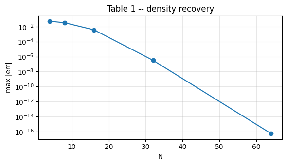
    


<div>
<style scoped>
    .dataframe tbody tr th:only-of-type {
        vertical-align: middle;
    }

    .dataframe tbody tr th {
        vertical-align: top;
    }

    .dataframe thead th {
        text-align: right;
    }
</style>
<table border="1" class="dataframe">
  <thead>
    <tr style="text-align: right;">
      <th></th>
      <th>N</th>
      <th>max |err|</th>
    </tr>
  </thead>
  <tbody>
    <tr>
      <th>0</th>
      <td>4</td>
      <td>0.0499985</td>
    </tr>
    <tr>
      <th>1</th>
      <td>8</td>
      <td>0.0320884</td>
    </tr>
    <tr>
      <th>2</th>
      <td>16</td>
      <td>0.00360674</td>
    </tr>
    <tr>
      <th>3</th>
      <td>32</td>
      <td>3.15108e-07</td>
    </tr>
    <tr>
      <th>4</th>
      <td>64</td>
      <td>5.50398e-17</td>
    </tr>
  </tbody>
</table>
</div>


# 2. F&O 2008 Table 2 -- BSM call: COS vs Carr-Madan (+ Lewis, FrFT)

$S = 100$, $K \in \{80, 100, 120\}$, $r = 0.1$, $q = 0$, $T = 0.1$, $\sigma = 0.25$. Carr-Madan uses the paper's stated Fourier truncation range $[0,100]$, so the frequency spacing is $\eta = 100/N$.

The low-$N$ Fourier methods can still be rough because their FFT/quadrature grids are too coarse. That is the point of the comparison: COS reaches high accuracy with many fewer terms.


```python
from cos_pricing.carr_madan import carr_madan_price
from cos_pricing.lewis import lewis_price

sig, r, q, T, S = 0.25, 0.1, 0.0, 0.1, 100.0
strikes_t2 = np.array([80.0, 100.0, 120.0])
ref_t2     = bsm_price(strikes_t2, S, sig, T, r, q, cp=+1)

m_cos  = BsmCos (sigma=sig, intr=r, divr=q)
m_frft = BsmFrft(sigma=sig, intr=r, divr=q)     # FrFT
fwd2   = S * np.exp((r - q) * T)
df2    = np.exp(-r * T)
cf_bsm = lambda u: np.exp(-0.5 * sig**2 * T * u * (u + 1j))   # CF of log(S_T/F)

rows = []
for N in [32, 64, 128, 256, 512]:
    m_cos.n_cos = N
    cos_e, cos_ms = bench(lambda: m_cos.price(strikes_t2, S, T, cp=+1), ref_t2)

    lw_e, lw_ms = bench(lambda: lewis_price(cf_bsm, T, strikes_t2, fwd2, df2, cp=+1, n_quad=N), ref_t2)

    m_frft.n_frft, m_frft.eta_frft, m_frft.lambda_frft = N, 100.0 / N, 0.005
    fr_e, fr_ms = bench(lambda: m_frft.price_frft(strikes_t2, S, T, cp=+1), ref_t2)

    cm_e, cm_ms = bench(
        lambda: carr_madan_price(cf_bsm, T, strikes_t2, fwd2, df2, cp=+1, N=N, eta_grid=100.0 / N),
        ref_t2,
    )

    rows.append((N, cos_e, cos_ms, lw_e, lw_ms, fr_e, fr_ms, cm_e, cm_ms))

df_t2 = pd.DataFrame(rows, columns=["N",
    "COS err", "COS ms", "Lewis err", "Lewis ms",
    "FrFT err", "FrFT ms", "CM err", "CM ms"])

methods = [("COS", "o-", "#1f77b4"), ("Lewis", "^-", "#2ca02c"),
           ("FrFT", "D-", "#9467bd"), ("Carr-Madan", "s-", "#ff7f0e")]
err_cols, ms_cols = ["COS err", "Lewis err", "FrFT err", "CM err"], ["COS ms", "Lewis ms", "FrFT ms", "CM ms"]

fig, (a1, a2) = plt.subplots(1, 2, figsize=(12, 4))
for (lbl, st, col), ec, mc in zip(methods, err_cols, ms_cols):
    a1.semilogy(df_t2["N"], plot_values(df_t2[ec], ec), st, label=lbl, color=col)
    a2.plot    (df_t2["N"], df_t2[mc], st, label=lbl, color=col)
a1.set(xlabel="N", ylabel="max |err|", title="Error vs N"); a1.grid(True, which="both", alpha=0.3); a1.legend()
a2.set(xlabel="N", ylabel="ms / call", title="Runtime vs N"); a2.grid(True, alpha=0.3); a2.legend()
fig.suptitle("Table 2 -- BSM: four Fourier pricers", y=1.02); fig.tight_layout(); plt.show()
display_error_table(df_t2)

```


    
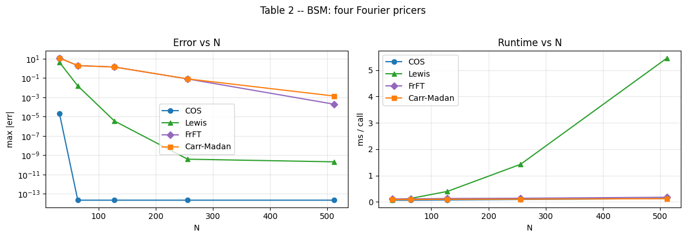
    


<div>
<style scoped>
    .dataframe tbody tr th:only-of-type {
        vertical-align: middle;
    }

    .dataframe tbody tr th {
        vertical-align: top;
    }

    .dataframe thead th {
        text-align: right;
    }
</style>
<table border="1" class="dataframe">
  <thead>
    <tr style="text-align: right;">
      <th></th>
      <th>N</th>
      <th>COS err</th>
      <th>COS ms</th>
      <th>Lewis err</th>
      <th>Lewis ms</th>
      <th>FrFT err</th>
      <th>FrFT ms</th>
      <th>CM err</th>
      <th>CM ms</th>
    </tr>
  </thead>
  <tbody>
    <tr>
      <th>0</th>
      <td>32</td>
      <td>2.04556e-05</td>
      <td>0.0627206</td>
      <td>4.16003</td>
      <td>0.0703529</td>
      <td>11.6747</td>
      <td>0.107997</td>
      <td>11.6837</td>
      <td>0.0873535</td>
    </tr>
    <tr>
      <th>1</th>
      <td>64</td>
      <td>&lt; 2e-14</td>
      <td>0.0621137</td>
      <td>0.0152252</td>
      <td>0.130764</td>
      <td>1.94114</td>
      <td>0.111256</td>
      <td>1.89294</td>
      <td>0.0900837</td>
    </tr>
    <tr>
      <th>2</th>
      <td>128</td>
      <td>&lt; 2e-14</td>
      <td>0.0719758</td>
      <td>3.52919e-06</td>
      <td>0.394471</td>
      <td>1.37346</td>
      <td>0.125808</td>
      <td>1.37366</td>
      <td>0.0961852</td>
    </tr>
    <tr>
      <th>3</th>
      <td>256</td>
      <td>&lt; 2e-14</td>
      <td>0.090479</td>
      <td>3.90014e-10</td>
      <td>1.42462</td>
      <td>0.0794379</td>
      <td>0.135665</td>
      <td>0.0805857</td>
      <td>0.10186</td>
    </tr>
    <tr>
      <th>4</th>
      <td>512</td>
      <td>&lt; 2e-14</td>
      <td>0.127043</td>
      <td>2.0811e-10</td>
      <td>5.46202</td>
      <td>0.000192206</td>
      <td>0.172622</td>
      <td>0.00135015</td>
      <td>0.119417</td>
    </tr>
  </tbody>
</table>
</div>


# 3. F&O 2008 Table 3 -- cash-or-nothing digital under BSM

Discontinuous payoff: COS doesn't suffer Gibbs as long as $\psi$ is computed analytically. Reference $K \cdot df \cdot N(d_2) \approx 0.27330649649$.


```python
S_d, K_d, r_d, q_d, T_d, sig_d, L_d = 100.0, 120.0, 0.05, 0.0, 0.1, 0.2, 10.0
fwd_d = S_d * np.exp((r_d - q_d) * T_d)
df_d  = np.exp(-r_d * T_d)
d2    = (np.log(fwd_d / K_d) - 0.5 * sig_d**2 * T_d) / (sig_d * np.sqrt(T_d))
ref_d = K_d * df_d * norm.cdf(d2)

def cos_digital(N):
    m   = BsmCos(sigma=sig_d, intr=r_d, divr=q_d)
    s2t = sig_d**2 * T_d
    c1  = -0.5 * s2t
    a, b = c1 - L_d * np.sqrt(s2t), c1 + L_d * np.sqrt(s2t)
    ba   = b - a
    k    = np.arange(N)
    u    = k * np.pi / ba
    phi  = m.charfunc_logprice(u, T_d) * np.exp(-1j * u * a); phi[0] *= 0.5
    log_kf = float(np.clip(np.log(K_d / fwd_d), a, b))
    safe_u = np.where(k == 0, 1.0, u)
    psi    = np.where(k == 0, b - log_kf,
                      (np.sin(u * (b - a)) - np.sin(u * (log_kf - a))) / safe_u)
    return df_d * float((2.0 / ba) * K_d * psi @ phi.real)

rows = [(N, cos_digital(N), abs(cos_digital(N) - ref_d)) for N in [40, 60, 80, 100, 120, 140]]
df_t3 = pd.DataFrame(rows, columns=["N", "COS price", "|err|"])

fig, ax = plt.subplots(figsize=(6, 3.5))
ax.semilogy(df_t3["N"], df_t3["|err|"], "o-", color="#1f77b4")
ax.set(xlabel="N", ylabel="|err|", title="Table 3 -- digital error vs N")
ax.grid(True, which="both", alpha=0.3); fig.tight_layout(); plt.show()
df_t3
```


    
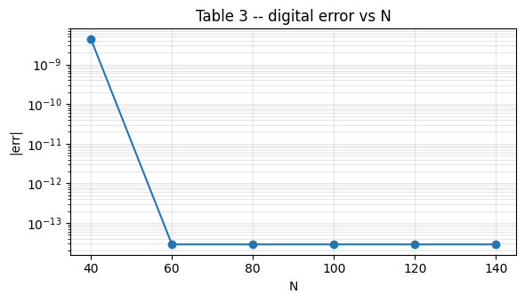
    


<div>
<style scoped>
    .dataframe tbody tr th:only-of-type {
        vertical-align: middle;
    }

    .dataframe tbody tr th {
        vertical-align: top;
    }

    .dataframe thead th {
        text-align: right;
    }
</style>
<table border="1" class="dataframe">
  <thead>
    <tr style="text-align: right;">
      <th></th>
      <th>N</th>
      <th>COS price</th>
      <th>|err|</th>
    </tr>
  </thead>
  <tbody>
    <tr>
      <th>0</th>
      <td>40</td>
      <td>0.273306</td>
      <td>4.40481e-09</td>
    </tr>
    <tr>
      <th>1</th>
      <td>60</td>
      <td>0.273306</td>
      <td>2.86438e-14</td>
    </tr>
    <tr>
      <th>2</th>
      <td>80</td>
      <td>0.273306</td>
      <td>2.86438e-14</td>
    </tr>
    <tr>
      <th>3</th>
      <td>100</td>
      <td>0.273306</td>
      <td>2.86438e-14</td>
    </tr>
    <tr>
      <th>4</th>
      <td>120</td>
      <td>0.273306</td>
      <td>2.86438e-14</td>
    </tr>
    <tr>
      <th>5</th>
      <td>140</td>
      <td>0.273306</td>
      <td>2.86438e-14</td>
    </tr>
  </tbody>
</table>
</div>


# 4. F&O 2008 Tables 4-5 -- Heston, $T=1$ and $T=10$

Eq. 52 parameters, $r = q = 0$, $K = 100$. COS and the transform methods use different grids, as in the paper: COS is tested on small $N$, while Lewis/Carr-Madan are tested on larger Fourier grids. Carr-Madan uses the paper's Fourier-domain truncations: $[0,1200]$ for $T=1$ and $[0,500]$ for $T=10$.

References: $C_{T=1} = 5.785155435$, $C_{T=10} = 22.31894579$ from F&O 2008.


```python
from cos_pricing.carr_madan import carr_madan_price

PAPER  = dict(sigma=0.0175, vov=0.5751, mr=1.5768, theta=0.0398,
               rho=-0.5711, intr=0.0, divr=0.0)
S0, K  = 100.0, 100.0
REFS   = {1.0: 5.785155435, 10.0: 22.318945791474590}
N_COS_H = {1.0: [40, 80, 120, 160, 200], 10.0: [40, 65, 90, 115, 140]}
N_FFT_H = [512, 1024, 2048, 4096, 8192]
CM_VMAX_H = {1.0: 1200.0, 10.0: 500.0}

m_cos = HestonCos(**PAPER)             # COS
m_lw  = pf.HestonFft(**PAPER)          # Lewis/FFT diagnostic from PyFENG
m_cf  = HestonCos(**PAPER)             # pyfeng's charfunc_logprice is already in log(S/F)

def _method_table(named_frames, err_name="err"):
    frames = []
    for name, df in named_frames:
        frame = df.copy()
        frame.insert(0, "method", name)
        frames.append(frame)
    return pd.concat(frames, ignore_index=True).set_index(["method", "N"])

def heston_sweep(T):
    ref = REFS[T]
    fwd = S0 * np.exp((PAPER["intr"] - PAPER["divr"]) * T)
    df  = np.exp(-PAPER["intr"] * T)
    cf  = lambda u: m_cf.charfunc_logprice(u, T)

    rows_cos, rows_lw, rows_cm = [], [], []
    for N in N_COS_H[T]:
        m_cos.n_cos = N
        e, ms = bench(lambda: m_cos.price(K, S0, T, cp=+1), ref)
        rows_cos.append((N, e, ms))

    for N in N_FFT_H:
        m_lw.n_x = N
        e, ms = bench(lambda: m_lw.price(K, S0, T, cp=+1), ref)
        rows_lw.append((N, e, ms))

        e, ms = bench(
            lambda: carr_madan_price(cf, T, K, fwd, df, cp=+1, N=N, eta_grid=CM_VMAX_H[T] / N),
            ref,
        )
        rows_cm.append((N, e, ms))
    return (pd.DataFrame(rows_cos, columns=["N", "err", "ms"]),
            pd.DataFrame(rows_lw,  columns=["N", "err", "ms"]),
            pd.DataFrame(rows_cm,  columns=["N", "err", "ms"]))

t4_cos, t4_lw, t4_cm = heston_sweep(1.0)
t5_cos, t5_lw, t5_cm = heston_sweep(10.0)

fig, axs = plt.subplots(2, 2, figsize=(13, 7))
for col, (T, dfs) in enumerate([(1.0, (t4_cos, t4_lw, t4_cm)), (10.0, (t5_cos, t5_lw, t5_cm))]):
    cos_d, lw_d, cm_d = dfs
    for ax, ycol, ylabel in [(axs[0, col], "err", "|err|"), (axs[1, col], "ms", "ms / call")]:
        ax.loglog(cos_d["N"], plot_values(cos_d[ycol], ycol), "o-", label="COS",        color="#1f77b4")
        ax.loglog(lw_d ["N"], plot_values(lw_d [ycol], ycol), "^-", label="Lewis",      color="#2ca02c")
        ax.loglog(cm_d ["N"], plot_values(cm_d [ycol], ycol), "s-", label="Carr-Madan", color="#ff7f0e")
        ax.set(xlabel="N", ylabel=ylabel, title=f"Table {4 if T==1.0 else 5} -- T={T:g}, {ylabel}")
        ax.grid(True, which="both", alpha=0.3); ax.legend()
fig.tight_layout(); plt.show()

print("Table 4 (T=1):")
display_error_table(_method_table([("COS", t4_cos), ("Lewis", t4_lw), ("CM", t4_cm)]))
print("Table 5 (T=10):")
display_error_table(_method_table([("COS", t5_cos), ("Lewis", t5_lw), ("CM", t5_cm)]))

```


    
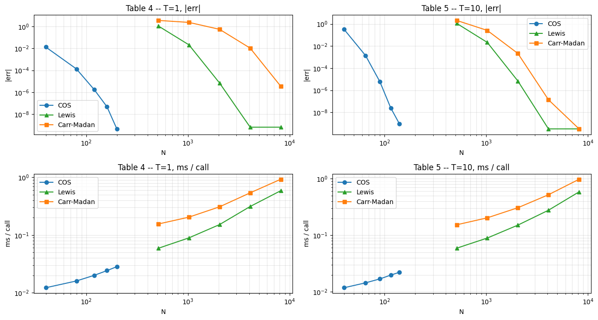
    


    Table 4 (T=1):


<div>
<style scoped>
    .dataframe tbody tr th:only-of-type {
        vertical-align: middle;
    }

    .dataframe tbody tr th {
        vertical-align: top;
    }

    .dataframe thead th {
        text-align: right;
    }
</style>
<table border="1" class="dataframe">
  <thead>
    <tr style="text-align: right;">
      <th></th>
      <th></th>
      <th>err</th>
      <th>ms</th>
    </tr>
    <tr>
      <th>method</th>
      <th>N</th>
      <th></th>
      <th></th>
    </tr>
  </thead>
  <tbody>
    <tr>
      <th rowspan="5" valign="top">COS</th>
      <th>40</th>
      <td>0.0134213</td>
      <td>0.0121892</td>
    </tr>
    <tr>
      <th>80</th>
      <td>0.000134617</td>
      <td>0.0159681</td>
    </tr>
    <tr>
      <th>120</th>
      <td>1.68462e-06</td>
      <td>0.0200206</td>
    </tr>
    <tr>
      <th>160</th>
      <td>4.60891e-08</td>
      <td>0.0241679</td>
    </tr>
    <tr>
      <th>200</th>
      <td>4.36043e-10</td>
      <td>0.0282794</td>
    </tr>
    <tr>
      <th rowspan="5" valign="top">Lewis</th>
      <th>512</th>
      <td>1.13144</td>
      <td>0.0589448</td>
    </tr>
    <tr>
      <th>1024</th>
      <td>0.0214134</td>
      <td>0.0893321</td>
    </tr>
    <tr>
      <th>2048</th>
      <td>6.89068e-06</td>
      <td>0.151786</td>
    </tr>
    <tr>
      <th>4096</th>
      <td>6.24167e-10</td>
      <td>0.312579</td>
    </tr>
    <tr>
      <th>8192</th>
      <td>6.24867e-10</td>
      <td>0.587444</td>
    </tr>
    <tr>
      <th rowspan="5" valign="top">CM</th>
      <th>512</th>
      <td>3.67341</td>
      <td>0.155363</td>
    </tr>
    <tr>
      <th>1024</th>
      <td>2.42182</td>
      <td>0.204307</td>
    </tr>
    <tr>
      <th>2048</th>
      <td>0.562918</td>
      <td>0.308541</td>
    </tr>
    <tr>
      <th>4096</th>
      <td>0.0107065</td>
      <td>0.539089</td>
    </tr>
    <tr>
      <th>8192</th>
      <td>3.44628e-06</td>
      <td>0.927311</td>
    </tr>
  </tbody>
</table>
</div>


    Table 5 (T=10):


<div>
<style scoped>
    .dataframe tbody tr th:only-of-type {
        vertical-align: middle;
    }

    .dataframe tbody tr th {
        vertical-align: top;
    }

    .dataframe thead th {
        text-align: right;
    }
</style>
<table border="1" class="dataframe">
  <thead>
    <tr style="text-align: right;">
      <th></th>
      <th></th>
      <th>err</th>
      <th>ms</th>
    </tr>
    <tr>
      <th>method</th>
      <th>N</th>
      <th></th>
      <th></th>
    </tr>
  </thead>
  <tbody>
    <tr>
      <th rowspan="5" valign="top">COS</th>
      <th>40</th>
      <td>0.322909</td>
      <td>0.0118192</td>
    </tr>
    <tr>
      <th>65</th>
      <td>0.0013988</td>
      <td>0.0144204</td>
    </tr>
    <tr>
      <th>90</th>
      <td>5.9599e-06</td>
      <td>0.0169317</td>
    </tr>
    <tr>
      <th>115</th>
      <td>2.55972e-08</td>
      <td>0.0197525</td>
    </tr>
    <tr>
      <th>140</th>
      <td>9.2631e-10</td>
      <td>0.022195</td>
    </tr>
    <tr>
      <th rowspan="5" valign="top">Lewis</th>
      <th>512</th>
      <td>1.13144</td>
      <td>0.0591165</td>
    </tr>
    <tr>
      <th>1024</th>
      <td>0.0214134</td>
      <td>0.0893721</td>
    </tr>
    <tr>
      <th>2048</th>
      <td>6.89099e-06</td>
      <td>0.151345</td>
    </tr>
    <tr>
      <th>4096</th>
      <td>3.19403e-10</td>
      <td>0.277501</td>
    </tr>
    <tr>
      <th>8192</th>
      <td>3.20082e-10</td>
      <td>0.586342</td>
    </tr>
    <tr>
      <th rowspan="5" valign="top">CM</th>
      <th>512</th>
      <td>2.08276</td>
      <td>0.153338</td>
    </tr>
    <tr>
      <th>1024</th>
      <td>0.260573</td>
      <td>0.203495</td>
    </tr>
    <tr>
      <th>2048</th>
      <td>0.00214501</td>
      <td>0.307192</td>
    </tr>
    <tr>
      <th>4096</th>
      <td>1.38406e-07</td>
      <td>0.521136</td>
    </tr>
    <tr>
      <th>8192</th>
      <td>3.20075e-10</td>
      <td>0.979213</td>
    </tr>
  </tbody>
</table>
</div>


# 5. F&O 2008 Table 6 -- Heston, $T = 1$, 21 strikes

Same Eq. 52 setup, but priced on the paper's 21-strike grid $K \in \{50, 55, 60, \ldots, 150\}$ and reporting `max |err|`. The paper uses separate grids: COS uses small $N$, while Carr-Madan uses larger FFT grids, so we display the methods in a long table instead of forcing mismatched `N` values into one row.


```python
K21 = np.arange(50.0, 151.0, 5.0)
T   = 1.0
N_COS_6 = [40, 80, 160, 200]
N_FFT_6 = [1024, 2048, 4096, 8192]
CM_VMAX_6 = 1200.0

m_ref = HestonCos(**PAPER); m_ref.n_cos = 8192
ref21 = m_ref.price(K21, S0, T, cp=+1)

fwd = S0 * np.exp((PAPER["intr"] - PAPER["divr"]) * T)
df  = np.exp(-PAPER["intr"] * T)
cf  = lambda u: m_cf.charfunc_logprice(u, T)

rows_cos, rows_lw, rows_cm = [], [], []
for N in N_COS_6:
    m_cos.n_cos = N
    e, ms = bench(lambda: m_cos.price(K21, S0, T, cp=+1), ref21)
    rows_cos.append((N, e, ms))

for N in N_FFT_6:
    m_lw.n_x = N
    e, ms = bench(lambda: m_lw.price(K21, S0, T, cp=+1), ref21)
    rows_lw.append((N, e, ms))

    e, ms = bench(
        lambda: carr_madan_price(cf, T, K21, fwd, df, cp=+1, N=N, eta_grid=CM_VMAX_6 / N),
        ref21,
    )
    rows_cm.append((N, e, ms))

t6_cos = pd.DataFrame(rows_cos, columns=["N", "max |err|", "ms"])
t6_lw  = pd.DataFrame(rows_lw,  columns=["N", "max |err|", "ms"])
t6_cm  = pd.DataFrame(rows_cm,  columns=["N", "max |err|", "ms"])

fig, (a1, a2) = plt.subplots(1, 2, figsize=(13, 3.8))
for ax, ycol, ylabel in [(a1, "max |err|", "max |err|"), (a2, "ms", "ms / call")]:
    ax.loglog(t6_cos["N"], plot_values(t6_cos[ycol], ycol), "o-", label="COS",        color="#1f77b4")
    ax.loglog(t6_lw ["N"], plot_values(t6_lw [ycol], ycol), "^-", label="Lewis",      color="#2ca02c")
    ax.loglog(t6_cm ["N"], plot_values(t6_cm [ycol], ycol), "s-", label="Carr-Madan", color="#ff7f0e")
    ax.set(xlabel="N", ylabel=ylabel, title=f"Table 6 -- 21 strikes, {ylabel}")
    ax.grid(True, which="both", alpha=0.3); ax.legend()
fig.tight_layout(); plt.show()

display_error_table(_method_table([("COS", t6_cos), ("Lewis", t6_lw), ("CM", t6_cm)]))

```


    
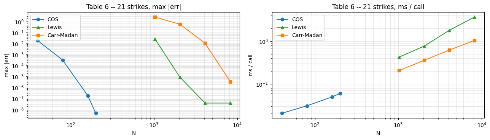
    


<div>
<style scoped>
    .dataframe tbody tr th:only-of-type {
        vertical-align: middle;
    }

    .dataframe tbody tr th {
        vertical-align: top;
    }

    .dataframe thead th {
        text-align: right;
    }
</style>
<table border="1" class="dataframe">
  <thead>
    <tr style="text-align: right;">
      <th></th>
      <th></th>
      <th>max |err|</th>
      <th>ms</th>
    </tr>
    <tr>
      <th>method</th>
      <th>N</th>
      <th></th>
      <th></th>
    </tr>
  </thead>
  <tbody>
    <tr>
      <th rowspan="4" valign="top">COS</th>
      <th>40</th>
      <td>0.0192133</td>
      <td>0.0204508</td>
    </tr>
    <tr>
      <th>80</th>
      <td>0.000320936</td>
      <td>0.0306333</td>
    </tr>
    <tr>
      <th>160</th>
      <td>1.90881e-07</td>
      <td>0.0494433</td>
    </tr>
    <tr>
      <th>200</th>
      <td>4.66808e-09</td>
      <td>0.0598181</td>
    </tr>
    <tr>
      <th rowspan="4" valign="top">Lewis</th>
      <th>1024</th>
      <td>0.0267668</td>
      <td>0.425896</td>
    </tr>
    <tr>
      <th>2048</th>
      <td>8.6135e-06</td>
      <td>0.773456</td>
    </tr>
    <tr>
      <th>4096</th>
      <td>3.94826e-08</td>
      <td>1.81496</td>
    </tr>
    <tr>
      <th>8192</th>
      <td>3.94833e-08</td>
      <td>3.7044</td>
    </tr>
    <tr>
      <th rowspan="4" valign="top">CM</th>
      <th>1024</th>
      <td>2.57051</td>
      <td>0.206342</td>
    </tr>
    <tr>
      <th>2048</th>
      <td>0.56432</td>
      <td>0.359179</td>
    </tr>
    <tr>
      <th>4096</th>
      <td>0.0107066</td>
      <td>0.623604</td>
    </tr>
    <tr>
      <th>8192</th>
      <td>3.48521e-06</td>
      <td>1.05007</td>
    </tr>
  </tbody>
</table>
</div>


# 6. F&O 2008 Table 7 -- Variance Gamma

This table uses the interval rule described immediately above Table 7 in Fang-Oosterlee: `T=1` uses `L=10`, while the short-maturity `T=0.1` case uses `L=20`. For this paper-reproduction table we use that original range, not the wider robust cumulant range used elsewhere in the project.

The printed PDF header appears to swap the two reference prices: the model gives `T=0.1 -> 10.993703186...` and `T=1 -> 19.099354724...`. We use the model-consistent maturities below and keep the paper error column exactly as printed.


```python
# Pyfeng's VarGammaCos uses vov in place of nu.
S0_vg, K_vg, R_vg, Q_vg = 100.0, 90.0, 0.1, 0.0
SIGMA, THETA, NU        = 0.12, -0.14, 0.2

PAPER_T01 = {128: 5.43e-4, 256: 7.08e-5, 512: 3.80e-6, 1024: 2.35e-5, 2048: 1.41e-7}
PAPER_T1  = {30: 6.08e-4, 60: 1.89e-7, 90: 1.60e-8, 120: 5.97e-10, 150: 3.29e-12}

def vg_table7_model(texp, L):
    """VG COS model using the original F&O Table 7 truncation range."""
    model = VarGammaCos(sigma=SIGMA, theta=THETA, vov=NU, intr=R_vg, divr=Q_vg)
    c2 = (SIGMA**2 + NU * THETA**2) * texp
    half_width = L * np.sqrt(c2)
    center = -(R_vg - Q_vg) * texp  # log(S0/F), matching the paper's x-centered range in z=log(S_T/F).

    def table7_range(strike, spot, t):
        return center - half_width, center + half_width

    model._integration_range = table7_range
    return model

def vg_table7_errors(texp, L, paper_errors):
    model = vg_table7_model(texp, L)
    model.n_cos = 2**15
    ref = model.price(K_vg, S0_vg, texp)
    rows = []
    for N, paper_err in paper_errors.items():
        model.n_cos = N
        rows.append((N, abs(model.price(K_vg, S0_vg, texp) - ref), paper_err))
    return ref, pd.DataFrame(rows, columns=["N", "our |err|", "paper |err|"])

ref_T1,  df_t7_T1  = vg_table7_errors(1.0, 10.0, PAPER_T1)
ref_T01, df_t7_T01 = vg_table7_errors(0.1, 20.0, PAPER_T01)

fig, (a1, a2) = plt.subplots(1, 2, figsize=(13, 3.8))
for ax, df, title in [(a1, df_t7_T1, "T=1, L=10"),
                      (a2, df_t7_T01, "T=0.1, L=20")]:
    ax.semilogy(df["N"], plot_values(df["our |err|"], "our |err|"), "o-", color="#1f77b4", label="ours")
    ax.semilogy(df["N"], plot_values(df["paper |err|"], "paper |err|"), "s--", color="#999", label="F&O 2008")
    ax.set(xlabel="N", ylabel="|err|", title=f"Table 7 -- VG, {title}")
    ax.grid(True, which="both", alpha=0.3); ax.legend()
fig.tight_layout(); plt.show()

print(f"T=1.0 reference used: {ref_T1:.12f}")
display_error_table(df_t7_T1)
print(f"T=0.1 reference used: {ref_T01:.12f}")
display_error_table(df_t7_T01)

```


    
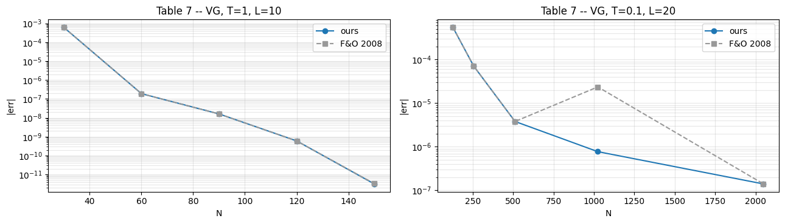
    


    T=1.0 reference used: 19.099354724202


<div>
<style scoped>
    .dataframe tbody tr th:only-of-type {
        vertical-align: middle;
    }

    .dataframe tbody tr th {
        vertical-align: top;
    }

    .dataframe thead th {
        text-align: right;
    }
</style>
<table border="1" class="dataframe">
  <thead>
    <tr style="text-align: right;">
      <th></th>
      <th>N</th>
      <th>our |err|</th>
      <th>paper |err|</th>
    </tr>
  </thead>
  <tbody>
    <tr>
      <th>0</th>
      <td>30</td>
      <td>0.000607638</td>
      <td>0.000608</td>
    </tr>
    <tr>
      <th>1</th>
      <td>60</td>
      <td>1.89433e-07</td>
      <td>1.89e-07</td>
    </tr>
    <tr>
      <th>2</th>
      <td>90</td>
      <td>1.60096e-08</td>
      <td>1.6e-08</td>
    </tr>
    <tr>
      <th>3</th>
      <td>120</td>
      <td>5.97446e-10</td>
      <td>5.97e-10</td>
    </tr>
    <tr>
      <th>4</th>
      <td>150</td>
      <td>3.16547e-12</td>
      <td>3.29e-12</td>
    </tr>
  </tbody>
</table>
</div>


    T=0.1 reference used: 10.993703186688


<div>
<style scoped>
    .dataframe tbody tr th:only-of-type {
        vertical-align: middle;
    }

    .dataframe tbody tr th {
        vertical-align: top;
    }

    .dataframe thead th {
        text-align: right;
    }
</style>
<table border="1" class="dataframe">
  <thead>
    <tr style="text-align: right;">
      <th></th>
      <th>N</th>
      <th>our |err|</th>
      <th>paper |err|</th>
    </tr>
  </thead>
  <tbody>
    <tr>
      <th>0</th>
      <td>128</td>
      <td>0.000543145</td>
      <td>0.000543</td>
    </tr>
    <tr>
      <th>1</th>
      <td>256</td>
      <td>7.07962e-05</td>
      <td>7.08e-05</td>
    </tr>
    <tr>
      <th>2</th>
      <td>512</td>
      <td>3.79678e-06</td>
      <td>3.8e-06</td>
    </tr>
    <tr>
      <th>3</th>
      <td>1024</td>
      <td>7.72415e-07</td>
      <td>2.35e-05</td>
    </tr>
    <tr>
      <th>4</th>
      <td>2048</td>
      <td>1.40744e-07</td>
      <td>1.41e-07</td>
    </tr>
  </tbody>
</table>
</div>


# 7. F&O 2008 Tables 8-10 -- CGMY at $Y \in \{0.5, 1.5, 1.98\}$

$S = K = 100$, $T = 1$, $r = 0.1$, $q = 0$, $C = 1$, $G = M = 5$. Larger $Y$ means more active small jumps and heavier numerical stress.

Tables 8 and 9 are COS paper-grid checks against the printed Fang-Oosterlee references. The paper compares COS to CONV; this notebook also shows a Carr-Madan diagnostic because CONV is not implemented in the repo.

Table 10 is **not** treated as a successful reproduction. With $Y = 1.98$ and the paper's stated range $[-100,20]$, our strict martingale CGMY implementation gives a high-$N$ price around `0.2601`, while the paper prints `0.252104475`. The very large low-$N$ error is a symptom of this unresolved range/implementation-convention mismatch, not evidence that COS failed in Tables 8-9. We show it as a caveat and omit the Carr-Madan overflow diagnostic for this case.


```python
S0_c, K_c, T_c, r_c, q_c = 100.0, 100.0, 1.0, 0.1, 0.0
C, G, M = 1.0, 5.0, 5.0
N_FFT_C = [512, 1024, 2048, 4096, 8192, 16384]

PAPER_CGMY = {
    0.5: dict(
        table=8,
        ref=19.8129487706,
        Ns=[40, 60, 80, 100, 120, 140],
        paper_err=[3.82e-02, 6.87e-04, 2.11e-05, 9.45e-07, 5.56e-08, 4.04e-09],
    ),
    1.5: dict(
        table=9,
        ref=49.790905305,
        Ns=[40, 45, 50, 55, 60, 65],
        paper_err=[1.38e+00, 1.98e-02, 4.52e-04, 9.59e-06, 1.22e-09, 7.53e-10],
    ),
    1.98: dict(
        table=10,
        ref=0.252104475,
        Ns=[20, 25, 30, 35, 40],
        paper_err=[4.17e-02, 5.15e-01, 6.54e-05, 1.10e-09, 1.94e-15],
    ),
}

fwd_c = S0_c * np.exp((r_c - q_c) * T_c)
df_c  = np.exp(-r_c * T_c)

def cgmy_paper_grid(Y):
    cfg = PAPER_CGMY[Y]
    cos_p = CgmyCos(C=C, G=G, M=M, Y=Y, intr=r_c, divr=q_c)
    cos_p.L = 10.0  # F&O Section 5.4: [-10Y, 10Y], except Y=1.98 uses [-100, 20]
    cf    = lambda u: cos_p.charfunc_logprice(u, T_c)   # already in log(S/F)
    paper_ref = cfg["ref"]

    cos_p.n_cos = 2**14
    internal_ref = float(cos_p.price(K_c, S0_c, T_c, cp=+1))

    rows_cos, rows_cm = [], []
    for N, paper_err in zip(cfg["Ns"], cfg["paper_err"]):
        cos_p.n_cos = N
        e, ms = bench(lambda: cos_p.price(K_c, S0_c, T_c, cp=+1), paper_ref)
        rows_cos.append((N, e, paper_err, ms))
    if not np.isclose(Y, 1.98):
        for N in N_FFT_C:
            e, ms = bench(lambda: carr_madan_price(cf, T_c, K_c, fwd_c, df_c, cp=+1, N=N), paper_ref)
            rows_cm.append((N, e, ms))
    return (
        paper_ref,
        internal_ref,
        pd.DataFrame(rows_cos, columns=["N", "our |err|", "paper |err|", "ms"]),
        pd.DataFrame(rows_cm,  columns=["N", "Carr-Madan |err|", "ms"]),
    )

results = {Y: cgmy_paper_grid(Y) for Y in PAPER_CGMY}

for Y, cfg in PAPER_CGMY.items():
    paper_ref, internal_ref, cos_d, cm_d = results[Y]
    fig, (a1, a2) = plt.subplots(1, 2, figsize=(12, 4))
    a1.loglog(cos_d["N"], plot_values(cos_d["our |err|"], "our |err|"), "o-", label="our COS", color="#1f77b4")
    a1.loglog(cos_d["N"], plot_values(cos_d["paper |err|"], "paper |err|"), "s--", label="F&O COS", color="#999")
    a1.set(xlabel="N", ylabel="|err|", title="COS error vs paper grid")
    a1.grid(True, which="both", alpha=0.3); a1.legend()

    if cm_d.empty:
        a2.text(0.5, 0.5, "Carr-Madan omitted:\ndamped FFT overflows here", ha="center", va="center", transform=a2.transAxes)
        a2.set_axis_off()
    else:
        a2.loglog(cm_d["N"], plot_values(cm_d["Carr-Madan |err|"], "Carr-Madan |err|"), "s-", label="Carr-Madan", color="#ff7f0e")
        a2.set(xlabel="N", ylabel="|err|", title="Carr-Madan diagnostic")
        a2.grid(True, which="both", alpha=0.3); a2.legend()

    fig.suptitle(
        f"Table {cfg['table']} -- CGMY Y={Y}  (paper ref = {paper_ref:.10f}, internal COS ref = {internal_ref:.10f})",
        y=1.03,
    )
    fig.tight_layout(); plt.show()

for Y, cfg in PAPER_CGMY.items():
    paper_ref, internal_ref, cos_d, cm_d = results[Y]
    print(f"Table {cfg['table']} -- CGMY Y={Y}")
    print(f"paper reference:   {paper_ref:.10f}")
    print(f"internal COS ref:  {internal_ref:.10f}")
    print("COS paper grid")
    display_error_table(cos_d.set_index("N"))
    if cm_d.empty:
        print("Carr-Madan diagnostic omitted for Y=1.98: damped FFT overflows/unstable here.")
    else:
        print("Carr-Madan diagnostic vs paper ref")
        display_error_table(cm_d.set_index("N"))

```


    
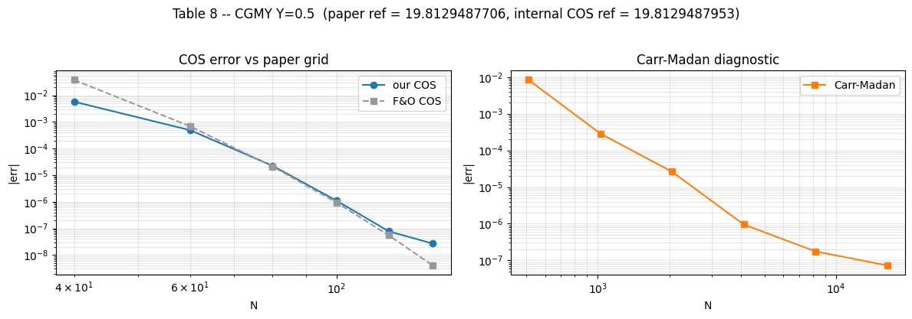
    


    
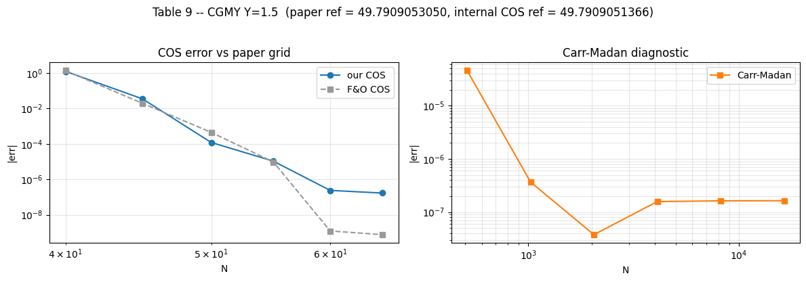
    


    
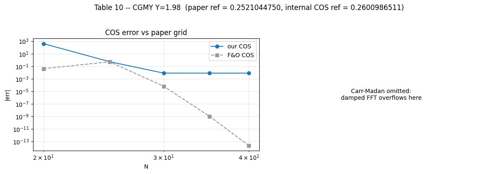
    


    Table 8 -- CGMY Y=0.5
    paper reference:   19.8129487706
    internal COS ref:  19.8129487953
    COS paper grid


<div>
<style scoped>
    .dataframe tbody tr th:only-of-type {
        vertical-align: middle;
    }

    .dataframe tbody tr th {
        vertical-align: top;
    }

    .dataframe thead th {
        text-align: right;
    }
</style>
<table border="1" class="dataframe">
  <thead>
    <tr style="text-align: right;">
      <th></th>
      <th>our |err|</th>
      <th>paper |err|</th>
      <th>ms</th>
    </tr>
    <tr>
      <th>N</th>
      <th></th>
      <th></th>
      <th></th>
    </tr>
  </thead>
  <tbody>
    <tr>
      <th>40</th>
      <td>0.00579334</td>
      <td>0.0382</td>
      <td>0.0638235</td>
    </tr>
    <tr>
      <th>60</th>
      <td>0.000491393</td>
      <td>0.000687</td>
      <td>0.0756385</td>
    </tr>
    <tr>
      <th>80</th>
      <td>2.26116e-05</td>
      <td>2.11e-05</td>
      <td>0.0766771</td>
    </tr>
    <tr>
      <th>100</th>
      <td>1.113e-06</td>
      <td>9.45e-07</td>
      <td>0.0825163</td>
    </tr>
    <tr>
      <th>120</th>
      <td>7.80023e-08</td>
      <td>5.56e-08</td>
      <td>0.0738529</td>
    </tr>
    <tr>
      <th>140</th>
      <td>2.68786e-08</td>
      <td>4.04e-09</td>
      <td>0.0761704</td>
    </tr>
  </tbody>
</table>
</div>


    Carr-Madan diagnostic vs paper ref


<div>
<style scoped>
    .dataframe tbody tr th:only-of-type {
        vertical-align: middle;
    }

    .dataframe tbody tr th {
        vertical-align: top;
    }

    .dataframe thead th {
        text-align: right;
    }
</style>
<table border="1" class="dataframe">
  <thead>
    <tr style="text-align: right;">
      <th></th>
      <th>Carr-Madan |err|</th>
      <th>ms</th>
    </tr>
    <tr>
      <th>N</th>
      <th></th>
      <th></th>
    </tr>
  </thead>
  <tbody>
    <tr>
      <th>512</th>
      <td>0.00837348</td>
      <td>0.167296</td>
    </tr>
    <tr>
      <th>1024</th>
      <td>0.000288182</td>
      <td>0.232349</td>
    </tr>
    <tr>
      <th>2048</th>
      <td>2.61792e-05</td>
      <td>0.451114</td>
    </tr>
    <tr>
      <th>4096</th>
      <td>9.50286e-07</td>
      <td>0.633728</td>
    </tr>
    <tr>
      <th>8192</th>
      <td>1.75376e-07</td>
      <td>1.159</td>
    </tr>
    <tr>
      <th>16384</th>
      <td>7.26305e-08</td>
      <td>2.21693</td>
    </tr>
  </tbody>
</table>
</div>


    Table 9 -- CGMY Y=1.5
    paper reference:   49.7909053050
    internal COS ref:  49.7909051366
    COS paper grid


<div>
<style scoped>
    .dataframe tbody tr th:only-of-type {
        vertical-align: middle;
    }

    .dataframe tbody tr th {
        vertical-align: top;
    }

    .dataframe thead th {
        text-align: right;
    }
</style>
<table border="1" class="dataframe">
  <thead>
    <tr style="text-align: right;">
      <th></th>
      <th>our |err|</th>
      <th>paper |err|</th>
      <th>ms</th>
    </tr>
    <tr>
      <th>N</th>
      <th></th>
      <th></th>
      <th></th>
    </tr>
  </thead>
  <tbody>
    <tr>
      <th>40</th>
      <td>1.25469</td>
      <td>1.38</td>
      <td>0.059221</td>
    </tr>
    <tr>
      <th>45</th>
      <td>0.0353538</td>
      <td>0.0198</td>
      <td>0.05987</td>
    </tr>
    <tr>
      <th>50</th>
      <td>0.000121552</td>
      <td>0.000452</td>
      <td>0.0604321</td>
    </tr>
    <tr>
      <th>55</th>
      <td>1.06786e-05</td>
      <td>9.59e-06</td>
      <td>0.0609146</td>
    </tr>
    <tr>
      <th>60</th>
      <td>2.38234e-07</td>
      <td>1.22e-09</td>
      <td>0.061665</td>
    </tr>
    <tr>
      <th>65</th>
      <td>1.68385e-07</td>
      <td>7.53e-10</td>
      <td>0.069191</td>
    </tr>
  </tbody>
</table>
</div>


    Carr-Madan diagnostic vs paper ref


<div>
<style scoped>
    .dataframe tbody tr th:only-of-type {
        vertical-align: middle;
    }

    .dataframe tbody tr th {
        vertical-align: top;
    }

    .dataframe thead th {
        text-align: right;
    }
</style>
<table border="1" class="dataframe">
  <thead>
    <tr style="text-align: right;">
      <th></th>
      <th>Carr-Madan |err|</th>
      <th>ms</th>
    </tr>
    <tr>
      <th>N</th>
      <th></th>
      <th></th>
    </tr>
  </thead>
  <tbody>
    <tr>
      <th>512</th>
      <td>4.54271e-05</td>
      <td>0.162919</td>
    </tr>
    <tr>
      <th>1024</th>
      <td>3.67881e-07</td>
      <td>0.230896</td>
    </tr>
    <tr>
      <th>2048</th>
      <td>3.76542e-08</td>
      <td>0.360378</td>
    </tr>
    <tr>
      <th>4096</th>
      <td>1.57435e-07</td>
      <td>0.624236</td>
    </tr>
    <tr>
      <th>8192</th>
      <td>1.62924e-07</td>
      <td>1.2233</td>
    </tr>
    <tr>
      <th>16384</th>
      <td>1.63523e-07</td>
      <td>2.23256</td>
    </tr>
  </tbody>
</table>
</div>


    Table 10 -- CGMY Y=1.98
    paper reference:   0.2521044750
    internal COS ref:  0.2600986511
    COS paper grid


<div>
<style scoped>
    .dataframe tbody tr th:only-of-type {
        vertical-align: middle;
    }

    .dataframe tbody tr th {
        vertical-align: top;
    }

    .dataframe thead th {
        text-align: right;
    }
</style>
<table border="1" class="dataframe">
  <thead>
    <tr style="text-align: right;">
      <th></th>
      <th>our |err|</th>
      <th>paper |err|</th>
      <th>ms</th>
    </tr>
    <tr>
      <th>N</th>
      <th></th>
      <th></th>
      <th></th>
    </tr>
  </thead>
  <tbody>
    <tr>
      <th>20</th>
      <td>403.716</td>
      <td>0.0417</td>
      <td>0.0562473</td>
    </tr>
    <tr>
      <th>25</th>
      <td>0.536674</td>
      <td>0.515</td>
      <td>0.0565879</td>
    </tr>
    <tr>
      <th>30</th>
      <td>0.00806645</td>
      <td>6.54e-05</td>
      <td>0.0601685</td>
    </tr>
    <tr>
      <th>35</th>
      <td>0.00799418</td>
      <td>1.1e-09</td>
      <td>0.0659935</td>
    </tr>
    <tr>
      <th>40</th>
      <td>0.00799418</td>
      <td>&lt; 2e-14</td>
      <td>0.0667173</td>
    </tr>
  </tbody>
</table>
</div>


    Carr-Madan diagnostic omitted for Y=1.98: damped FFT overflows/unstable here.


## Dimensional analysis story

The short version from the class slides is:

1. Equations must be dimensionally homogeneous.
2. Inputs to $\log(x)$, $e^x$, $\sin(x)$, and $\cos(x)$ must be dimensionless.
3. Buckingham's $\pi$ theorem reduces raw dimensional variables to dimensionless groups.

For Black-Scholes, the variables are $C,S_0,K,r,\sigma,T$ with price and time as base dimensions. The dimensionless representation is

$$
\frac{C}{S_0}=f\left(\frac{K}{S_0},\sigma\sqrt{T},rT\right).
$$

This immediately implies scale invariance:

$$
S_0\to \lambda S_0,\quad K\to \lambda K \quad \Rightarrow \quad C\to \lambda C.
$$

This also explains why Fourier option pricing naturally uses log-moneyness: $\log(S_0/K)$ is legal because $S_0/K$ is dimensionless.

**What the tables show.** The spatial scale-invariance tables test $C(\lambda S_0,\lambda K)=\lambda C(S_0,K)$ across BSM, Heston, VG, and CGMY. The errors are around $10^{-16}$ to $10^{-14}$, which is floating-point noise. So these are not just numerical benchmarks; they are structural correctness checks.

**What the BSM image shows.** The BSM collapse plot shows the surface $C/S_0=f(K/S_0,\sigma\sqrt{T})$. Different raw triples $(S_0,T,\sigma)$ land on the same surface when their dimensionless groups match. That is the visual version of Buckingham $\pi$.

**What the Heston image shows.** Heston has more parameters, but the same idea holds. After fixing the dimensionless Heston groups such as $\rho$, $\kappa T$, $\bar vT$, $\eta T$, and $(r-q)T$, the plotted slice becomes $C/S_0=f(K/S_0,\sqrt{v_0T})$. Different raw Heston parameter sets collapse onto the same surface.

**Why this matters.** Dimensional analysis acts as a test harness: if the pricer violates a symmetry predicted by Buckingham $\pi$, then something is wrong in the implementation, even if no closed-form benchmark is available.


# 8. Dimensional (Buckingham π) invariance

The project's original methodological work beyond F&O 2008. Coordinate changes that leave the SDE invariant should leave the dimensionless price invariant -- catches unit/truncation/discount slips that closed-form checks miss.

| Model | π-groups | Symmetries here |
|---|---|---|
| BSM    | 3 | scale (S, K) |
| Heston | 8 | scale + 7-param temporal rotation |
| VG     | 5 | scale + temporal rotation |
| CGMY   | 6 | scale + temporal rotation |

## 8.1 &nbsp; BSM scale invariance

Multiply $S$ and $K$ by the same $\lambda$. Since $K/S$ is the only dimensionless moneyness group, $C/S$ should not change.

The table reports the worst normalized residual, $|C(\lambda S,\lambda K)/(\lambda S)-C(S,K)/S|$, across strikes and maturities. Values below the display floor are shown as `< 2e-14`, meaning floating-point-level agreement rather than missing data.


```python
LAMBDAS = [0.1, 0.5, 2.0, 10.0, 100.0]
SPOT, STRIKES_PI, TEXPS = 100.0, np.array([70., 85., 100., 115., 130.]), [0.1, 1.0, 5.0]
bsm_pi = BsmCos(sigma=0.25, intr=0.05, divr=0.02)

rows = []
for lam in LAMBDAS:
    for cp in (+1, -1):
        worst = 0.0
        for texp in TEXPS:
            base   = bsm_pi.price(STRIKES_PI,       SPOT,       texp, cp=cp)
            scaled = bsm_pi.price(STRIKES_PI * lam, SPOT * lam, texp, cp=cp)
            worst  = max(worst, float(np.max(np.abs(scaled / SPOT / lam - base / SPOT))))
        rows.append((lam, "call" if cp == +1 else "put", worst))

df_bsm_scale = pd.DataFrame(rows, columns=["lambda", "cp", "worst normalized residual"])
display_small_residuals(df_bsm_scale)

```


<div>
<style scoped>
    .dataframe tbody tr th:only-of-type {
        vertical-align: middle;
    }

    .dataframe tbody tr th {
        vertical-align: top;
    }

    .dataframe thead th {
        text-align: right;
    }
</style>
<table border="1" class="dataframe">
  <thead>
    <tr style="text-align: right;">
      <th></th>
      <th>lambda</th>
      <th>cp</th>
      <th>worst normalized residual</th>
    </tr>
  </thead>
  <tbody>
    <tr>
      <th>0</th>
      <td>0.1</td>
      <td>call</td>
      <td>&lt; 2e-14</td>
    </tr>
    <tr>
      <th>1</th>
      <td>0.1</td>
      <td>put</td>
      <td>&lt; 2e-14</td>
    </tr>
    <tr>
      <th>2</th>
      <td>0.5</td>
      <td>call</td>
      <td>&lt; 2e-14</td>
    </tr>
    <tr>
      <th>3</th>
      <td>0.5</td>
      <td>put</td>
      <td>&lt; 2e-14</td>
    </tr>
    <tr>
      <th>4</th>
      <td>2</td>
      <td>call</td>
      <td>&lt; 2e-14</td>
    </tr>
    <tr>
      <th>5</th>
      <td>2</td>
      <td>put</td>
      <td>&lt; 2e-14</td>
    </tr>
    <tr>
      <th>6</th>
      <td>10</td>
      <td>call</td>
      <td>&lt; 2e-14</td>
    </tr>
    <tr>
      <th>7</th>
      <td>10</td>
      <td>put</td>
      <td>&lt; 2e-14</td>
    </tr>
    <tr>
      <th>8</th>
      <td>100</td>
      <td>call</td>
      <td>&lt; 2e-14</td>
    </tr>
    <tr>
      <th>9</th>
      <td>100</td>
      <td>put</td>
      <td>&lt; 2e-14</td>
    </tr>
  </tbody>
</table>
</div>


## 8.2 &nbsp; BSM dimensionless collapse (`docs/fig_bsm_collapse.png`)

BSM with $r = q = 0$ reduces to two π-groups: $K/S_0$ and $\sigma\sqrt{T}$. The whole BSM call surface lives on $C/S_0 = f(K/S_0, \sigma\sqrt{T})$. Three raw triples with 16× range in $(S_0, T, \sigma)$ all land on the same surface -- the visual π-theorem.


```python
L_BSM, N_K_s, N_V_s = 20.0, 28, 28
k_over_s   = np.linspace(0.5, 2.0, N_K_s)
sig_sqT    = np.linspace(0.05, 0.8, N_V_s)
KK_s, VV_s = np.meshgrid(k_over_s, sig_sqT, indexing="ij")

def bsm_surface(S0, T, KK, VV):
    Z = np.empty_like(KK)
    for j in range(VV.shape[1]):
        m = BsmCos(sigma=float(VV[0, j] / np.sqrt(T))); m.L = L_BSM
        Z[:, j] = m.price(KK[:, j] * S0, S0, T, cp=+1) / S0
    return Z

Z_bsm = bsm_surface(100.0, 1.0, KK_s, VV_s)

triples = [
    ("S0=50,  T=2,    sigma=0.14",   50.0, 2.00, 0.14, np.array([0.7, 1.0, 1.3])),
    ("S0=250, T=0.25, sigma=0.80",  250.0, 0.25, 0.80, np.array([0.6, 0.9, 1.4])),
    ("S0=1000,T=4,    sigma=0.30", 1000.0, 4.00, 0.30, np.array([0.8, 1.1, 1.8])),
]

fig = plt.figure(figsize=(9, 6.5))
ax  = fig.add_subplot(111, projection="3d")
ax.plot_surface(KK_s, VV_s, Z_bsm, cmap="viridis", alpha=0.65, linewidth=0, antialiased=True)
for (lbl, S0, T, sig, mn), col, mk in zip(triples,
        ["#d62728", "#ff7f0e", "#1f77b4"], ["o", "s", "^"]):
    m  = BsmCos(sigma=sig); m.L = L_BSM
    px = m.price(mn * S0, S0, T, cp=+1) / S0
    ax.scatter(mn, np.full_like(mn, sig * np.sqrt(T)), px, s=80, color=col,
               marker=mk, edgecolor="black", linewidth=0.7, label=lbl, depthshade=False)
ax.set(xlabel=r"$K/S_0$", ylabel=r"$\sigma\sqrt{T}$", zlabel=r"$C/S_0$")
ax.set_title("BSM dimensionless surface -- three raw triples collapse onto it")
ax.view_init(elev=22, azim=-58); ax.legend(loc="upper left", fontsize=8.5, framealpha=0.92)
fig.tight_layout(); plt.show()

# Numeric collapse at sigma*sqrt(T) = 0.4
common = [(50.0, 2.00, 0.4 / np.sqrt(2.00)),
          (250.0, 0.25, 0.4 / np.sqrt(0.25)),
          (1000.0, 4.00, 0.4 / np.sqrt(4.00))]
rows = []
for moneyness in [0.7, 1.0, 1.3, 1.6]:
    row = [moneyness]
    for S0, T, sig in common:
        m = BsmCos(sigma=sig); m.L = L_BSM
        row.append(float(m.price(moneyness * S0, S0, T, cp=+1)) / S0)
    row.append(max(row[1:]) - min(row[1:]))
    rows.append(row)
df_bsm_collapse = pd.DataFrame(rows, columns=["K/S0", "triple 1", "triple 2", "triple 3", "spread"])
display_small_residuals(df_bsm_collapse, cols=["spread"])
```


    
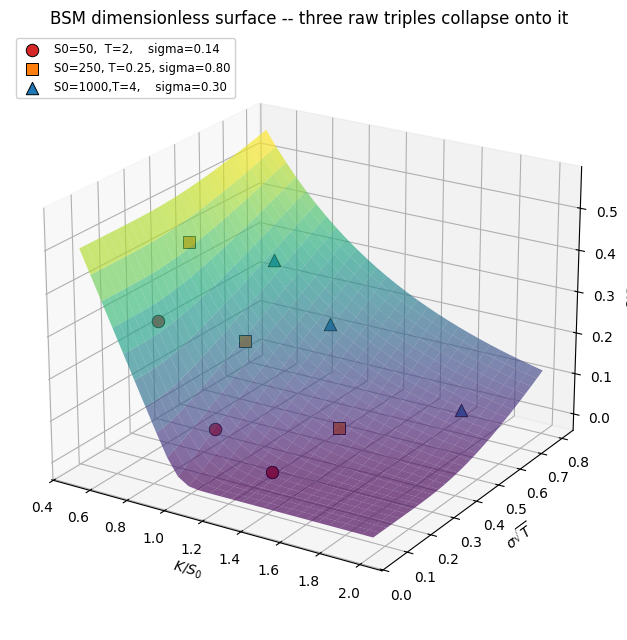
    


<div>
<style scoped>
    .dataframe tbody tr th:only-of-type {
        vertical-align: middle;
    }

    .dataframe tbody tr th {
        vertical-align: top;
    }

    .dataframe thead th {
        text-align: right;
    }
</style>
<table border="1" class="dataframe">
  <thead>
    <tr style="text-align: right;">
      <th></th>
      <th>K/S0</th>
      <th>triple 1</th>
      <th>triple 2</th>
      <th>triple 3</th>
      <th>spread</th>
    </tr>
  </thead>
  <tbody>
    <tr>
      <th>0</th>
      <td>0.7</td>
      <td>0.333712</td>
      <td>0.333712</td>
      <td>0.333712</td>
      <td>&lt; 2e-14</td>
    </tr>
    <tr>
      <th>1</th>
      <td>1</td>
      <td>0.158519</td>
      <td>0.158519</td>
      <td>0.158519</td>
      <td>&lt; 2e-14</td>
    </tr>
    <tr>
      <th>2</th>
      <td>1.3</td>
      <td>0.0693964</td>
      <td>0.0693964</td>
      <td>0.0693964</td>
      <td>&lt; 2e-14</td>
    </tr>
    <tr>
      <th>3</th>
      <td>1.6</td>
      <td>0.029475</td>
      <td>0.029475</td>
      <td>0.029475</td>
      <td>&lt; 2e-14</td>
    </tr>
  </tbody>
</table>
</div>


## 8.3 &nbsp; Spatial scale invariance -- all four pricers

This repeats the same scale test across BSM, Heston, VG, and CGMY. The residual column is the worst normalized difference after scaling both spot and strike by $\lambda$. Values shown as `< 2e-14` are floating-point-level agreement.


```python
def _bsm   (S, K, T, cp): return BsmCos(sigma=0.25).price(K, S, T, cp=cp)
def _heston(S, K, T, cp): return HestonCos(sigma=0.04, vov=0.5, mr=1.5, theta=0.04, rho=-0.5).price(K, S, T, cp=cp)
def _vg    (S, K, T, cp):
    m = VarGammaCos(sigma=0.12, theta=-0.14, vov=0.2); m.n_cos = 256
    return m.price(K, S, T, cp=cp)
def _cgmy  (S, K, T, cp):
    m = CgmyCos(C=1.0, G=5.0, M=5.0, Y=0.5); m.n_cos = 256
    return m.price(K, S, T, cp=cp)

PRICERS = [("BsmCos", _bsm), ("HestonCos", _heston), ("VarGammaCos", _vg), ("CgmyCos", _cgmy)]
SPOT_PI2, STRIKES_PI2, TEXPS_PI2, LAMBDAS_PI2 = 100.0, np.array([85., 100., 115.]), [0.5, 1.0, 2.0], LAMBDAS

rows = []
for name, pricer in PRICERS:
    for lam in LAMBDAS_PI2:
        worst = 0.0
        for cp in (+1, -1):
            for texp in TEXPS_PI2:
                base  = np.array([pricer(SPOT_PI2,       K,       texp, cp) for K in STRIKES_PI2])
                other = np.array([pricer(SPOT_PI2 * lam, K * lam, texp, cp) for K in STRIKES_PI2])
                worst = max(worst, float(np.max(np.abs(other / (SPOT_PI2 * lam) - base / SPOT_PI2))))
        rows.append((name, lam, worst))

df_all_scale = pd.DataFrame(rows, columns=["model", "lambda", "worst normalized residual"])
display_small_residuals(df_all_scale)

```


<div>
<style scoped>
    .dataframe tbody tr th:only-of-type {
        vertical-align: middle;
    }

    .dataframe tbody tr th {
        vertical-align: top;
    }

    .dataframe thead th {
        text-align: right;
    }
</style>
<table border="1" class="dataframe">
  <thead>
    <tr style="text-align: right;">
      <th></th>
      <th>model</th>
      <th>lambda</th>
      <th>worst normalized residual</th>
    </tr>
  </thead>
  <tbody>
    <tr>
      <th>0</th>
      <td>BsmCos</td>
      <td>0.1</td>
      <td>&lt; 2e-14</td>
    </tr>
    <tr>
      <th>1</th>
      <td>BsmCos</td>
      <td>0.5</td>
      <td>&lt; 2e-14</td>
    </tr>
    <tr>
      <th>2</th>
      <td>BsmCos</td>
      <td>2</td>
      <td>&lt; 2e-14</td>
    </tr>
    <tr>
      <th>3</th>
      <td>BsmCos</td>
      <td>10</td>
      <td>&lt; 2e-14</td>
    </tr>
    <tr>
      <th>4</th>
      <td>BsmCos</td>
      <td>100</td>
      <td>&lt; 2e-14</td>
    </tr>
    <tr>
      <th>5</th>
      <td>HestonCos</td>
      <td>0.1</td>
      <td>&lt; 2e-14</td>
    </tr>
    <tr>
      <th>6</th>
      <td>HestonCos</td>
      <td>0.5</td>
      <td>&lt; 2e-14</td>
    </tr>
    <tr>
      <th>7</th>
      <td>HestonCos</td>
      <td>2</td>
      <td>&lt; 2e-14</td>
    </tr>
    <tr>
      <th>8</th>
      <td>HestonCos</td>
      <td>10</td>
      <td>&lt; 2e-14</td>
    </tr>
    <tr>
      <th>9</th>
      <td>HestonCos</td>
      <td>100</td>
      <td>&lt; 2e-14</td>
    </tr>
    <tr>
      <th>10</th>
      <td>VarGammaCos</td>
      <td>0.1</td>
      <td>&lt; 2e-14</td>
    </tr>
    <tr>
      <th>11</th>
      <td>VarGammaCos</td>
      <td>0.5</td>
      <td>&lt; 2e-14</td>
    </tr>
    <tr>
      <th>12</th>
      <td>VarGammaCos</td>
      <td>2</td>
      <td>&lt; 2e-14</td>
    </tr>
    <tr>
      <th>13</th>
      <td>VarGammaCos</td>
      <td>10</td>
      <td>&lt; 2e-14</td>
    </tr>
    <tr>
      <th>14</th>
      <td>VarGammaCos</td>
      <td>100</td>
      <td>&lt; 2e-14</td>
    </tr>
    <tr>
      <th>15</th>
      <td>CgmyCos</td>
      <td>0.1</td>
      <td>&lt; 2e-14</td>
    </tr>
    <tr>
      <th>16</th>
      <td>CgmyCos</td>
      <td>0.5</td>
      <td>&lt; 2e-14</td>
    </tr>
    <tr>
      <th>17</th>
      <td>CgmyCos</td>
      <td>2</td>
      <td>&lt; 2e-14</td>
    </tr>
    <tr>
      <th>18</th>
      <td>CgmyCos</td>
      <td>10</td>
      <td>&lt; 2e-14</td>
    </tr>
    <tr>
      <th>19</th>
      <td>CgmyCos</td>
      <td>100</td>
      <td>&lt; 2e-14</td>
    </tr>
  </tbody>
</table>
</div>


## 8.4 &nbsp; Heston temporal $\pi$-invariance

Substituting $t = \mu\tau'$ and rescaling Brownians by $\sqrt{\mu}$ leaves Heston dynamics invariant under $(T, r, q, \kappa, \eta, v_0, \bar u) \to (\mu T, r/\mu, q/\mu, \kappa/\mu, \eta/\mu, v_0/\mu, \bar u/\mu)$. We pin both pricers to the same absolute log-moneyness half-width so the COS grids are bit-identical.

The residual is the worst normalized price difference across the strike grid:

$$
\max_K\frac{|C_{resc}(K)-C_{base}(K)|}{S_0}.
$$

Values below the display floor are shown as `< 2e-14`; those are floating-point-level residuals, not skipped or missing rows.


```python
MUS, STRIKES_H, TAU_BASE = LAMBDAS, np.array([70., 85., 100., 115., 130.]), 1.0
N_COS_H, HALF_WIDTH, S0_H = 256, 12.0, 100.0
BASE = dict(sigma=0.04, mr=1.5, vov=0.4, theta=0.04, rho=-0.7, intr=0.03, divr=0.01)

def rescale(p, mu):
    out = dict(p)
    for k in ("sigma", "mr", "vov", "theta", "intr", "divr"): out[k] = p[k] / mu
    return out
sigma_h = lambda p: float(np.sqrt(p["theta"] + p["sigma"] * p["vov"]))

def price_pinned(m, p, S0, K, tau, cp):
    m.n_cos, m.L = N_COS_H, HALF_WIDTH / sigma_h(p)
    return m.price(K, S0, tau, cp=cp)

rows = []
for mu in MUS:
    for cp in (+1, -1):
        bp, rp = BASE, rescale(BASE, mu)
        bm, rm = HestonCos(**bp), HestonCos(**rp)
        p_base = price_pinned(bm, bp, S0_H, STRIKES_H, TAU_BASE,      cp)
        p_resc = price_pinned(rm, rp, S0_H, STRIKES_H, mu * TAU_BASE, cp)
        worst  = float(np.max(np.abs(p_resc - p_base) / S0_H))
        rows.append((mu, "call" if cp == +1 else "put", worst))

resid_col_heston = "worst normalized residual"
df_heston_temporal = pd.DataFrame(rows, columns=["mu", "cp", resid_col_heston])
shown_heston_temporal = df_heston_temporal.copy()
shown_heston_temporal[resid_col_heston] = shown_heston_temporal[resid_col_heston].map(
    lambda x: f"< {ERR_FLOOR:.0e}" if abs(float(x)) < ERR_FLOOR else x
)
display(shown_heston_temporal)

```


<div>
<style scoped>
    .dataframe tbody tr th:only-of-type {
        vertical-align: middle;
    }

    .dataframe tbody tr th {
        vertical-align: top;
    }

    .dataframe thead th {
        text-align: right;
    }
</style>
<table border="1" class="dataframe">
  <thead>
    <tr style="text-align: right;">
      <th></th>
      <th>mu</th>
      <th>cp</th>
      <th>worst normalized residual</th>
    </tr>
  </thead>
  <tbody>
    <tr>
      <th>0</th>
      <td>0.1</td>
      <td>call</td>
      <td>5.63099e-12</td>
    </tr>
    <tr>
      <th>1</th>
      <td>0.1</td>
      <td>put</td>
      <td>&lt; 2e-14</td>
    </tr>
    <tr>
      <th>2</th>
      <td>0.5</td>
      <td>call</td>
      <td>&lt; 2e-14</td>
    </tr>
    <tr>
      <th>3</th>
      <td>0.5</td>
      <td>put</td>
      <td>&lt; 2e-14</td>
    </tr>
    <tr>
      <th>4</th>
      <td>2</td>
      <td>call</td>
      <td>&lt; 2e-14</td>
    </tr>
    <tr>
      <th>5</th>
      <td>2</td>
      <td>put</td>
      <td>&lt; 2e-14</td>
    </tr>
    <tr>
      <th>6</th>
      <td>10</td>
      <td>call</td>
      <td>7.46908e-12</td>
    </tr>
    <tr>
      <th>7</th>
      <td>10</td>
      <td>put</td>
      <td>&lt; 2e-14</td>
    </tr>
    <tr>
      <th>8</th>
      <td>100</td>
      <td>call</td>
      <td>5.43052e-12</td>
    </tr>
    <tr>
      <th>9</th>
      <td>100</td>
      <td>put</td>
      <td>&lt; 2e-14</td>
    </tr>
  </tbody>
</table>
</div>


## 8.5 &nbsp; Heston dimensionless collapse (`docs/fig_heston_collapse.png`)

Heston has 8 π-groups -- after fixing the five rate-dimensioned ones ($\rho$, $\kappa T$, $\bar v T$, $\eta T$, $(r-q)T$), the price lives on $C/S_0 = f(K/S_0, \sqrt{v_0 T})$. Three sextets with very different raw $(S_0, T, v_0, \kappa, \bar u, \eta)$ collapse onto the same surface.


```python
PI_RHO, PI_RT, PI_KAPPA_T, PI_UBAR_T, PI_ETA_T = -0.70, 0.0, 1.50, 0.04, 0.40
N_Kh, N_Vh, HALF_WIDTH_H, N_COS_H_PLOT = 22, 22, 10.0, 256
k_over_sh = np.linspace(0.5, 2.0, N_Kh)
sqrt_v0T  = np.linspace(0.10, 0.60, N_Vh)
KKh, VVh  = np.meshgrid(k_over_sh, sqrt_v0T, indexing="ij")

def _make(T, sigT):
    return HestonCos(sigma=sigT**2 / T, mr=PI_KAPPA_T / T, vov=PI_ETA_T / T,
                     theta=PI_UBAR_T / T, rho=PI_RHO, intr=PI_RT / T, divr=0.0)
_L_for = lambda m: HALF_WIDTH_H / float(np.sqrt(m.theta + m.sigma * m.vov))

def heston_surface(S0, T, KK, VV):
    Z = np.empty_like(KK)
    for j in range(VV.shape[1]):
        m = _make(T, float(VV[0, j])); m.n_cos, m.L = N_COS_H_PLOT, _L_for(m)
        Z[:, j] = m.price(KK[:, j] * S0, S0, T, cp=+1) / S0
    return Z

Z_h = heston_surface(100.0, 1.0, KKh, VVh)

spread_specs = [
    (   50.0, 2.00, 0.30, np.array([0.7, 1.0, 1.3]), "S0=50,  T=2.00, v0=0.045, kappa=0.75"),
    (  250.0, 0.25, 0.55, np.array([0.6, 0.9, 1.4]), "S0=250, T=0.25, v0=1.21,  kappa=6.00"),
    ( 1000.0, 4.00, 0.20, np.array([0.8, 1.1, 1.8]), "S0=1000,T=4.00, v0=0.010, kappa=0.375"),
]

fig = plt.figure(figsize=(10, 7))
ax  = fig.add_subplot(111, projection="3d")
ax.plot_surface(KKh, VVh, Z_h, cmap="plasma", alpha=0.65, linewidth=0, antialiased=True)
for (S0, T, sigT, mn, lbl), col, mk in zip(spread_specs,
        ["#d62728", "#ff7f0e", "#1f77b4"], ["o", "s", "^"]):
    m  = _make(T, sigT); m.n_cos, m.L = N_COS_H_PLOT, _L_for(m)
    px = m.price(mn * S0, S0, T, cp=+1) / S0
    ax.scatter(mn, np.full_like(mn, sigT), px, s=80, color=col,
               marker=mk, edgecolor="black", linewidth=0.7, label=lbl, depthshade=False)
ax.set(xlabel=r"$K/S_0$", ylabel=r"$\sqrt{v_0 T}$", zlabel=r"$C/S_0$")
ax.set_title("Heston dimensionless surface -- different raw sextets collapse onto it\n"
             r"fixed: $\rho=-0.7,\ \kappa T=1.5,\ \bar v T=0.04,\ \eta T=0.4,\ (r-q)T=0$",
             fontsize=10)
ax.legend(loc="upper left", fontsize=8, framealpha=0.92); ax.view_init(elev=22, azim=-58)
fig.tight_layout(); plt.show()

common = [(50.0, 2.00, 0.40), (250.0, 0.25, 0.40), (1000.0, 4.00, 0.40)]
rows = []
for moneyness in [0.7, 1.0, 1.3, 1.6]:
    row = [moneyness]
    for S0, T, sigT in common:
        m = _make(T, sigT); m.n_cos, m.L = N_COS_H_PLOT, _L_for(m)
        row.append(float(m.price(moneyness * S0, S0, T, cp=+1)) / S0)
    row.append(max(row[1:]) - min(row[1:]))
    rows.append(row)
df_heston_collapse = pd.DataFrame(rows, columns=["K/S0", "triple 1", "triple 2", "triple 3", "spread"])
display_small_residuals(df_heston_collapse, cols=["spread"])
```


    
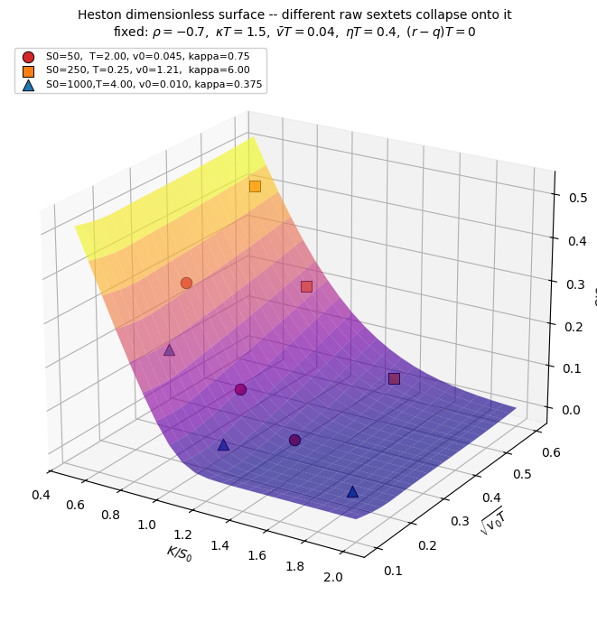
    


<div>
<style scoped>
    .dataframe tbody tr th:only-of-type {
        vertical-align: middle;
    }

    .dataframe tbody tr th {
        vertical-align: top;
    }

    .dataframe thead th {
        text-align: right;
    }
</style>
<table border="1" class="dataframe">
  <thead>
    <tr style="text-align: right;">
      <th></th>
      <th>K/S0</th>
      <th>triple 1</th>
      <th>triple 2</th>
      <th>triple 3</th>
      <th>spread</th>
    </tr>
  </thead>
  <tbody>
    <tr>
      <th>0</th>
      <td>0.7</td>
      <td>0.324371</td>
      <td>0.324371</td>
      <td>0.324371</td>
      <td>&lt; 2e-14</td>
    </tr>
    <tr>
      <th>1</th>
      <td>1</td>
      <td>0.120087</td>
      <td>0.120087</td>
      <td>0.120087</td>
      <td>&lt; 2e-14</td>
    </tr>
    <tr>
      <th>2</th>
      <td>1.3</td>
      <td>0.0245684</td>
      <td>0.0245684</td>
      <td>0.0245684</td>
      <td>&lt; 2e-14</td>
    </tr>
    <tr>
      <th>3</th>
      <td>1.6</td>
      <td>0.0027273</td>
      <td>0.0027273</td>
      <td>0.0027273</td>
      <td>&lt; 2e-14</td>
    </tr>
  </tbody>
</table>
</div>


## 8.6 &nbsp; Joint spatial × temporal

Spatial scale $\alpha$ on $(S_0, K)$ combined with temporal rotation $\mu$ -- two of the eight $\pi$-groups held invariant simultaneously.

The residual is

$$
\left|\frac{C_{resc}}{\alpha S_0}-\frac{C_{base}}{S_0}\right|.
$$

Values below the display floor are shown as `< 2e-14`; that means the two normalized prices are equal up to price-scale double precision, not that the test was skipped.


```python
rows = []
for mu in [0.5, 2.0, 10.0]:
    for alpha in [0.5, 2.0, 100.0]:
        for cp in (+1, -1):
            bp, rp = BASE, rescale(BASE, mu)
            bm, rm = HestonCos(**bp), HestonCos(**rp)
            S0_resc = alpha * S0_H
            p_base = price_pinned(bm, bp, S0_H,    STRIKES_H,         TAU_BASE,      cp)
            p_resc = price_pinned(rm, rp, S0_resc, alpha * STRIKES_H, mu * TAU_BASE, cp)
            worst  = float(np.max(np.abs(p_resc / S0_resc - p_base / S0_H)))
            rows.append((alpha, mu, "call" if cp == +1 else "put", worst))

resid_col = "worst normalized residual"
df_joint = pd.DataFrame(rows, columns=["alpha", "mu", "cp", resid_col])
shown_joint = df_joint.copy()
shown_joint[resid_col] = shown_joint[resid_col].map(
    lambda x: f"< {ERR_FLOOR:.0e}" if abs(float(x)) < ERR_FLOOR else x
)
display(shown_joint)

```


<div>
<style scoped>
    .dataframe tbody tr th:only-of-type {
        vertical-align: middle;
    }

    .dataframe tbody tr th {
        vertical-align: top;
    }

    .dataframe thead th {
        text-align: right;
    }
</style>
<table border="1" class="dataframe">
  <thead>
    <tr style="text-align: right;">
      <th></th>
      <th>alpha</th>
      <th>mu</th>
      <th>cp</th>
      <th>worst normalized residual</th>
    </tr>
  </thead>
  <tbody>
    <tr>
      <th>0</th>
      <td>0.5</td>
      <td>0.5</td>
      <td>call</td>
      <td>&lt; 2e-14</td>
    </tr>
    <tr>
      <th>1</th>
      <td>0.5</td>
      <td>0.5</td>
      <td>put</td>
      <td>&lt; 2e-14</td>
    </tr>
    <tr>
      <th>2</th>
      <td>2</td>
      <td>0.5</td>
      <td>call</td>
      <td>&lt; 2e-14</td>
    </tr>
    <tr>
      <th>3</th>
      <td>2</td>
      <td>0.5</td>
      <td>put</td>
      <td>&lt; 2e-14</td>
    </tr>
    <tr>
      <th>4</th>
      <td>100</td>
      <td>0.5</td>
      <td>call</td>
      <td>&lt; 2e-14</td>
    </tr>
    <tr>
      <th>5</th>
      <td>100</td>
      <td>0.5</td>
      <td>put</td>
      <td>&lt; 2e-14</td>
    </tr>
    <tr>
      <th>6</th>
      <td>0.5</td>
      <td>2</td>
      <td>call</td>
      <td>&lt; 2e-14</td>
    </tr>
    <tr>
      <th>7</th>
      <td>0.5</td>
      <td>2</td>
      <td>put</td>
      <td>&lt; 2e-14</td>
    </tr>
    <tr>
      <th>8</th>
      <td>2</td>
      <td>2</td>
      <td>call</td>
      <td>&lt; 2e-14</td>
    </tr>
    <tr>
      <th>9</th>
      <td>2</td>
      <td>2</td>
      <td>put</td>
      <td>&lt; 2e-14</td>
    </tr>
    <tr>
      <th>10</th>
      <td>100</td>
      <td>2</td>
      <td>call</td>
      <td>&lt; 2e-14</td>
    </tr>
    <tr>
      <th>11</th>
      <td>100</td>
      <td>2</td>
      <td>put</td>
      <td>&lt; 2e-14</td>
    </tr>
    <tr>
      <th>12</th>
      <td>0.5</td>
      <td>10</td>
      <td>call</td>
      <td>7.46908e-12</td>
    </tr>
    <tr>
      <th>13</th>
      <td>0.5</td>
      <td>10</td>
      <td>put</td>
      <td>&lt; 2e-14</td>
    </tr>
    <tr>
      <th>14</th>
      <td>2</td>
      <td>10</td>
      <td>call</td>
      <td>7.46908e-12</td>
    </tr>
    <tr>
      <th>15</th>
      <td>2</td>
      <td>10</td>
      <td>put</td>
      <td>&lt; 2e-14</td>
    </tr>
    <tr>
      <th>16</th>
      <td>100</td>
      <td>10</td>
      <td>call</td>
      <td>7.46908e-12</td>
    </tr>
    <tr>
      <th>17</th>
      <td>100</td>
      <td>10</td>
      <td>put</td>
      <td>&lt; 2e-14</td>
    </tr>
  </tbody>
</table>
</div>


## Bermudan options: what the table is showing

A European option can be exercised only at maturity. An American option can be exercised continuously. A Bermudan option is in between: it can be exercised on a finite set of dates.

The COS extension handles Bermudan options by backward induction:

1. At maturity, initialize the cosine coefficients from the payoff.
2. Step backward one exercise date at a time.
3. At each date, compare continuation value with immediate exercise value.
4. Solve for the exercise boundary $x^*$.
5. Split the interval at $x^*$ and update the coefficients using analytic $\chi$ and $\psi$ integrals plus the continuation matrix.

The validation logic is simple and important:

- If $M=1$, Bermudan equals European exactly.
- More exercise dates cannot reduce the price.
- As $M$ grows, the Bermudan price approaches the American option price.

That is exactly what the table below shows: the $M=1$ case matches the European put, and the prices increase toward the known American benchmark near 6.55.


# 9. Bermudan -- F&O 2009

*Pricing Early-Exercise and Discrete Barrier Options by Fourier-Cosine Series Expansions*, **Numer. Math. 114:27-62**. §5.1 BSM benchmark: $S = K = 100$, $T = 1$, $\sigma = 0.25$, $r = 0.1$, $q = 0$. Two structural facts: $M = 1$ recovers the European put exactly; prices are non-decreasing in $M$ with American limit $\approx 6.55$.

## 9.1 &nbsp; European-limit check ($M = 1$)


```python
S_b, K_b, T_b, sigma_b, r_b, q_b = 100.0, 100.0, 1.0, 0.25, 0.1, 0.0
ber = BermudanBsmCos(sigma=sigma_b, intr=r_b, divr=q_b)
ber.n_exercise, ber.n_cos = 1, 128

ber_M1 = ber.price_bermudan(K_b, S_b, T_b, cp=-1)
eu     = float(bsm_price(K_b, S_b, sigma_b, T_b, intr=r_b, divr=q_b, cp=-1))

pd.DataFrame({"price": [eu, ber_M1, abs(ber_M1 - eu)]},
             index=["European put (analytic)", "Bermudan(M=1) (COS)", "|difference|"])
```


<div>
<style scoped>
    .dataframe tbody tr th:only-of-type {
        vertical-align: middle;
    }

    .dataframe tbody tr th {
        vertical-align: top;
    }

    .dataframe thead th {
        text-align: right;
    }
</style>
<table border="1" class="dataframe">
  <thead>
    <tr style="text-align: right;">
      <th></th>
      <th>price</th>
    </tr>
  </thead>
  <tbody>
    <tr>
      <th>European put (analytic)</th>
      <td>5.45953</td>
    </tr>
    <tr>
      <th>Bermudan(M=1) (COS)</th>
      <td>5.45953</td>
    </tr>
    <tr>
      <th>|difference|</th>
      <td>2.66454e-15</td>
    </tr>
  </tbody>
</table>
</div>


## 9.2 &nbsp; Convergence to the American limit


```python
ber.n_cos = 128
prev = eu
rows = []
for M in [1, 2, 4, 8, 16, 32, 64, 100, 200]:
    ber.n_exercise = M
    p = ber.price_bermudan(K_b, S_b, T_b, cp=-1)
    rows.append((M, p, p - prev))
    prev = p
df_ber = pd.DataFrame(rows, columns=["M", "Bermudan price", "increment"])

fig, (a1, a2) = plt.subplots(1, 2, figsize=(12, 4))
a1.plot(df_ber["M"], df_ber["Bermudan price"], "o-", color="#1f77b4", label="Bermudan")
a1.axhline(eu,   color="#999",    linestyle="--", linewidth=1.0, label=f"European put = {eu:.4f}")
a1.axhline(6.55, color="#d62728", linestyle=":",  linewidth=1.0, label="American limit ~ 6.55")
a1.set(xlabel="M", ylabel="price", title="Bermudan put converging to American")
a1.set_xscale("log"); a1.grid(True, alpha=0.3); a1.legend()
a2.semilogy(df_ber["M"], df_ber["increment"].clip(lower=1e-15), "s-", color="#ff7f0e")
a2.set(xlabel="M", ylabel="increment vs prev M", title="Early-exercise premium per M-step")
a2.set_xscale("log"); a2.grid(True, which="both", alpha=0.3)
fig.tight_layout(); plt.show()
df_ber
```


    
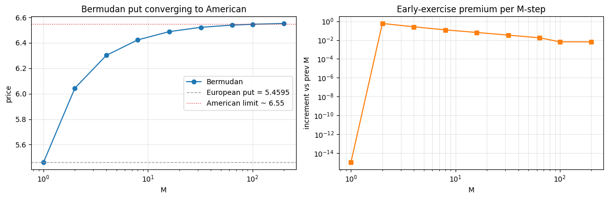
    


<div>
<style scoped>
    .dataframe tbody tr th:only-of-type {
        vertical-align: middle;
    }

    .dataframe tbody tr th {
        vertical-align: top;
    }

    .dataframe thead th {
        text-align: right;
    }
</style>
<table border="1" class="dataframe">
  <thead>
    <tr style="text-align: right;">
      <th></th>
      <th>M</th>
      <th>Bermudan price</th>
      <th>increment</th>
    </tr>
  </thead>
  <tbody>
    <tr>
      <th>0</th>
      <td>1</td>
      <td>5.45953</td>
      <td>-2.66454e-15</td>
    </tr>
    <tr>
      <th>1</th>
      <td>2</td>
      <td>6.04394</td>
      <td>0.584408</td>
    </tr>
    <tr>
      <th>2</th>
      <td>4</td>
      <td>6.3018</td>
      <td>0.257863</td>
    </tr>
    <tr>
      <th>3</th>
      <td>8</td>
      <td>6.42335</td>
      <td>0.121546</td>
    </tr>
    <tr>
      <th>4</th>
      <td>16</td>
      <td>6.48809</td>
      <td>0.0647446</td>
    </tr>
    <tr>
      <th>5</th>
      <td>32</td>
      <td>6.52188</td>
      <td>0.0337897</td>
    </tr>
    <tr>
      <th>6</th>
      <td>64</td>
      <td>6.53931</td>
      <td>0.0174268</td>
    </tr>
    <tr>
      <th>7</th>
      <td>100</td>
      <td>6.54587</td>
      <td>0.00655758</td>
    </tr>
    <tr>
      <th>8</th>
      <td>200</td>
      <td>6.55228</td>
      <td>0.00641564</td>
    </tr>
  </tbody>
</table>
</div>


# 10. Post-presentation extension: strike-independent smiles and JP ranges

This section updates the project after the class presentation.  The point is to move from pricing one option at a time to pricing a whole volatility smile more like a production calibration routine.

## 10.1 Strike-independent COS setup

For fixed model parameters, expiry, forward, discount factor, and interval $[a,b]$, the expensive density side is strike-independent:

- cosine grid $u_k = k\pi/(b-a)$
- characteristic-function samples $arphi(u_k)$
- phase-shifted, prime-weighted real density coefficients

The strike still enters through the payoff boundary $\log(K/F)$, so payoff coefficients are rebuilt for the strike vector.  But the density coefficients can be cached once and reused.

In code this is:

```python
setup = make_cos_smile_setup(cf, T, fwd, df, n_cos=N, trunc_range=(a, b))
prices = setup.price(strikes, cp=1)
```

The existing `price(...)` path remains unchanged.


```python
from cos_pricing import CgmyModel, make_cos_smile_setup

model_smile = CgmyModel(C=1.0, G=5.0, M=10.0, Y=1.5, intr=0.1, divr=0.0)
S_smile, T_smile, N_smile = 100.0, 1.0, 512
fwd_smile, df_smile = model_smile._fwd_df(S_smile, T_smile)
cf_smile = model_smile.char_func(T_smile)
trunc_smile = model_smile.trunc_range(T_smile)
setup_smile = make_cos_smile_setup(
    cf_smile, T_smile, fwd_smile, df_smile,
    n_cos=N_smile, trunc_range=trunc_smile,
)

def _mean_ms(fn, repeats=120):
    fn()  # warm-up
    t0 = time.perf_counter()
    for _ in range(repeats):
        fn()
    return (time.perf_counter() - t0) / repeats * 1e3

rows = []
for n_strikes in [5, 25, 101]:
    strikes = np.linspace(60.0, 140.0, n_strikes)

    def scalar_loop():
        return np.array([
            model_smile.price(float(K), S_smile, T_smile, cp=1, n_cos=N_smile)
            for K in strikes
        ])

    def vector_price():
        return model_smile.price(strikes, S_smile, T_smile, cp=1, n_cos=N_smile)

    def setup_price():
        return setup_smile.price(strikes, cp=1)

    scalar_ms = _mean_ms(scalar_loop)
    vector_ms = _mean_ms(vector_price)
    setup_ms = _mean_ms(setup_price)
    ref = vector_price()
    rows.append({
        "strikes": n_strikes,
        "scalar loop ms": scalar_ms,
        "vector price ms": vector_ms,
        "reusable setup ms": setup_ms,
        "loop/setup speedup": scalar_ms / setup_ms,
        "vector/setup speedup": vector_ms / setup_ms,
        "max |setup-vector|": float(np.max(np.abs(setup_price() - ref))),
    })

df_smile_bench = pd.DataFrame(rows)
df_smile_bench

```


<div>
<style scoped>
    .dataframe tbody tr th:only-of-type {
        vertical-align: middle;
    }

    .dataframe tbody tr th {
        vertical-align: top;
    }

    .dataframe thead th {
        text-align: right;
    }
</style>
<table border="1" class="dataframe">
  <thead>
    <tr style="text-align: right;">
      <th></th>
      <th>strikes</th>
      <th>scalar loop ms</th>
      <th>vector price ms</th>
      <th>reusable setup ms</th>
      <th>loop/setup speedup</th>
      <th>vector/setup speedup</th>
      <th>max |setup-vector|</th>
    </tr>
  </thead>
  <tbody>
    <tr>
      <th>0</th>
      <td>5</td>
      <td>0.452488</td>
      <td>0.114815</td>
      <td>0.0510125</td>
      <td>8.87014</td>
      <td>2.25071</td>
      <td>0</td>
    </tr>
    <tr>
      <th>1</th>
      <td>25</td>
      <td>2.23262</td>
      <td>0.225352</td>
      <td>0.159804</td>
      <td>13.971</td>
      <td>1.41018</td>
      <td>0</td>
    </tr>
    <tr>
      <th>2</th>
      <td>101</td>
      <td>9.08129</td>
      <td>0.645513</td>
      <td>0.557467</td>
      <td>16.2903</td>
      <td>1.15794</td>
      <td>0</td>
    </tr>
  </tbody>
</table>
</div>


## 10.2 Junike-Pankrashkin range selection

Junike-Pankrashkin (2022) chooses the COS truncation range using Markov's inequality on the centered log-return.  In words:

1. Center the log-return around its mean.
2. Use an even central moment, typically the 8th moment, to bound tail probability.
3. Pick a symmetric half-width $L$ large enough for the requested tolerance.
4. Use the interval $[c_1-L, c_1+L]$ in the log-forward variable.

We implemented this as an optional range, not as the default.  The Fang-Oosterlee ranges remain unchanged unless we explicitly call `jp_trunc_range(...)` or `trunc_range="jp"`.


```python
from cos_pricing import BsmModel, VgModel

range_models = [
    ("BSM", BsmModel(sigma=0.2), 1.0),
    ("VG", VgModel(sigma=0.12, theta=-0.14, nu=0.2, intr=0.1), 1.0),
    ("CGMY", CgmyModel(C=1.0, G=5.0, M=10.0, Y=0.5, intr=0.1), 1.0),
]
range_rows = []
for name, model, T in range_models:
    fo_a, fo_b = model.trunc_range(T)
    for eps in [1e-4, 1e-6, 1e-8]:
        jp_a, jp_b = model.jp_trunc_range(T, eps_tol=eps, moment_order=8)
        range_rows.append({
            "model": name,
            "eps": eps,
            "FO width": fo_b - fo_a,
            "JP width": jp_b - jp_a,
            "JP center": 0.5 * (jp_a + jp_b),
            "FO center": 0.5 * (fo_a + fo_b),
        })

df_jp_ranges = pd.DataFrame(range_rows)
df_jp_ranges

```


<div>
<style scoped>
    .dataframe tbody tr th:only-of-type {
        vertical-align: middle;
    }

    .dataframe tbody tr th {
        vertical-align: top;
    }

    .dataframe thead th {
        text-align: right;
    }
</style>
<table border="1" class="dataframe">
  <thead>
    <tr style="text-align: right;">
      <th></th>
      <th>model</th>
      <th>eps</th>
      <th>FO width</th>
      <th>JP width</th>
      <th>JP center</th>
      <th>FO center</th>
    </tr>
  </thead>
  <tbody>
    <tr>
      <th>0</th>
      <td>BSM</td>
      <td>0.0001</td>
      <td>4.8</td>
      <td>3.6028</td>
      <td>-0.02</td>
      <td>-0.02</td>
    </tr>
    <tr>
      <th>1</th>
      <td>BSM</td>
      <td>1e-06</td>
      <td>4.8</td>
      <td>4.97969</td>
      <td>-0.02</td>
      <td>-0.02</td>
    </tr>
    <tr>
      <th>2</th>
      <td>BSM</td>
      <td>1e-08</td>
      <td>4.8</td>
      <td>7.80436</td>
      <td>-0.02</td>
      <td>-0.02</td>
    </tr>
    <tr>
      <th>3</th>
      <td>VG</td>
      <td>0.0001</td>
      <td>3.74183</td>
      <td>2.4555</td>
      <td>-0.00893297</td>
      <td>-0.00893297</td>
    </tr>
    <tr>
      <th>4</th>
      <td>VG</td>
      <td>1e-06</td>
      <td>3.74183</td>
      <td>3.63229</td>
      <td>-0.00893297</td>
      <td>-0.00893297</td>
    </tr>
    <tr>
      <th>5</th>
      <td>VG</td>
      <td>1e-08</td>
      <td>3.74183</td>
      <td>6.45923</td>
      <td>-0.00893297</td>
      <td>-0.00893297</td>
    </tr>
    <tr>
      <th>6</th>
      <td>CGMY</td>
      <td>0.0001</td>
      <td>10</td>
      <td>5.95319</td>
      <td>-0.0508652</td>
      <td>0</td>
    </tr>
    <tr>
      <th>7</th>
      <td>CGMY</td>
      <td>1e-06</td>
      <td>10</td>
      <td>9.25423</td>
      <td>-0.0508652</td>
      <td>0</td>
    </tr>
    <tr>
      <th>8</th>
      <td>CGMY</td>
      <td>1e-08</td>
      <td>10</td>
      <td>16.4566</td>
      <td>-0.0508652</td>
      <td>0</td>
    </tr>
  </tbody>
</table>
</div>


## 10.3 Black-Scholes control variate

The Black-Scholes control variate is now implemented as an optional COS path:

$$
C_{model}^{CV}=C_{model}^{COS}+\left(C_{BS}^{exact}-C_{BS}^{COS}\right).
$$

The correction term measures the COS truncation/series error in a Black-Scholes model where the exact price is known.  The key is that the Black-Scholes COS leg uses the same log-forward interval as the target model, so the correction is aimed at the same numerical range/grid error.

Equivalent volatility choices used here:

- Heston: $\sigma_{eq}=\sqrt{E[\bar V_T]}$, where $E[\bar V_T]=\bar v+(v_0-\bar v)(1-e^{-\kappa T})/(\kappa T)$.
- VG/CGMY: $\sigma_{eq}=\sqrt{c_2/T}$, where $c_2$ is the second cumulant of $\log(S_T/F)$.

The table below shows the effect at coarse $N$.  This is intentionally opt-in: the correction helps in these coarse-grid examples, but jump models with extreme parameters, especially CGMY near $Y=2$, can behave differently.


```python
from cos_pricing import HestonCOSPricer, VgModel, CgmyModel

heston_cv = HestonCOSPricer(
    S0=100.0,
    v0=PAPER["sigma"],
    lam=PAPER["mr"],
    eta=PAPER["vov"],
    ubar=PAPER["theta"],
    rho=PAPER["rho"],
    r=PAPER["intr"],
    q=PAPER["divr"],
)
vg_cv = VgModel(sigma=0.12, theta=-0.14, nu=0.2, intr=0.1, divr=0.0)
cgmy_cv = CgmyModel(C=1.0, G=5.0, M=5.0, Y=0.5, intr=0.1, divr=0.0)

cv_specs = [
    ("Heston", [8, 16, 32, 64], REFS[1.0],
     lambda N: heston_cv.price_call(100.0, 1.0, N=N),
     lambda N: heston_cv.price_call_cv(100.0, 1.0, N=N),
     lambda: heston_cv.equivalent_bsm_vol(1.0)),
    ("VG", [16, 32, 64, 128], 19.099354724,
     lambda N: vg_cv.price(90.0, 100.0, 1.0, cp=1, n_cos=N),
     lambda N: vg_cv.price_cv(90.0, 100.0, 1.0, cp=1, n_cos=N),
     lambda: vg_cv.equivalent_bsm_vol(1.0)),
    ("CGMY Y=0.5", [16, 32, 64, 128], 19.8129488424,
     lambda N: cgmy_cv.price(100.0, 100.0, 1.0, cp=1, n_cos=N),
     lambda N: cgmy_cv.price_cv(100.0, 100.0, 1.0, cp=1, n_cos=N),
     lambda: cgmy_cv.equivalent_bsm_vol(1.0)),
]

cv_rows = []
for name, n_list, ref, plain_fn, cv_fn, vol_fn in cv_specs:
    for N in n_list:
        plain = plain_fn(N)
        cv = cv_fn(N)
        cv_rows.append({
            "model": name,
            "N": N,
            "plain COS": plain,
            "CV COS": cv,
            "plain |err|": abs(plain - ref),
            "CV |err|": abs(cv - ref),
            "sigma_eq": vol_fn(),
        })

df_cv = pd.DataFrame(cv_rows).set_index(["model", "N"])
display_error_table(df_cv)

```


<div>
<style scoped>
    .dataframe tbody tr th:only-of-type {
        vertical-align: middle;
    }

    .dataframe tbody tr th {
        vertical-align: top;
    }

    .dataframe thead th {
        text-align: right;
    }
</style>
<table border="1" class="dataframe">
  <thead>
    <tr style="text-align: right;">
      <th></th>
      <th></th>
      <th>plain COS</th>
      <th>CV COS</th>
      <th>plain |err|</th>
      <th>CV |err|</th>
      <th>sigma_eq</th>
    </tr>
    <tr>
      <th>model</th>
      <th>N</th>
      <th></th>
      <th></th>
      <th></th>
      <th></th>
      <th></th>
    </tr>
  </thead>
  <tbody>
    <tr>
      <th rowspan="4" valign="top">Heston</th>
      <th>8</th>
      <td>1.76268</td>
      <td>5.39643</td>
      <td>4.02248</td>
      <td>0.388724</td>
      <td>0.169056</td>
    </tr>
    <tr>
      <th>16</th>
      <td>5.11455</td>
      <td>5.36169</td>
      <td>0.67061</td>
      <td>0.423467</td>
      <td>0.169056</td>
    </tr>
    <tr>
      <th>32</th>
      <td>5.73152</td>
      <td>5.73186</td>
      <td>0.0536316</td>
      <td>0.0532911</td>
      <td>0.169056</td>
    </tr>
    <tr>
      <th>64</th>
      <td>5.78573</td>
      <td>5.78573</td>
      <td>0.000578452</td>
      <td>0.000578452</td>
      <td>0.169056</td>
    </tr>
    <tr>
      <th rowspan="4" valign="top">VG</th>
      <th>16</th>
      <td>18.6231</td>
      <td>18.9427</td>
      <td>0.476249</td>
      <td>0.156658</td>
      <td>0.135351</td>
    </tr>
    <tr>
      <th>32</th>
      <td>19.0963</td>
      <td>19.0967</td>
      <td>0.00304306</td>
      <td>0.0026614</td>
      <td>0.135351</td>
    </tr>
    <tr>
      <th>64</th>
      <td>19.0993</td>
      <td>19.0993</td>
      <td>1.12628e-05</td>
      <td>1.12628e-05</td>
      <td>0.135351</td>
    </tr>
    <tr>
      <th>128</th>
      <td>19.0994</td>
      <td>19.0994</td>
      <td>6.85777e-09</td>
      <td>6.8578e-09</td>
      <td>0.135351</td>
    </tr>
    <tr>
      <th rowspan="4" valign="top">CGMY Y=0.5</th>
      <th>16</th>
      <td>10.8618</td>
      <td>17.4642</td>
      <td>8.95118</td>
      <td>2.34875</td>
      <td>0.398162</td>
    </tr>
    <tr>
      <th>32</th>
      <td>19.7876</td>
      <td>19.7897</td>
      <td>0.0253781</td>
      <td>0.0232846</td>
      <td>0.398162</td>
    </tr>
    <tr>
      <th>64</th>
      <td>19.8132</td>
      <td>19.8132</td>
      <td>0.000265881</td>
      <td>0.000265881</td>
      <td>0.398162</td>
    </tr>
    <tr>
      <th>128</th>
      <td>19.8129</td>
      <td>19.8129</td>
      <td>3.16088e-08</td>
      <td>3.16102e-08</td>
      <td>0.398162</td>
    </tr>
  </tbody>
</table>
</div>

